# CVCraft - Toàn bộ Activity Diagrams (29 Use Cases)

> Tài liệu mô tả **luồng hoạt động** (activity flow) cho 29 ca sử dụng của hệ thống CVCraft.  
> Sử dụng Mermaid `flowchart TD` — tập trung vào **CÁI GÌ** hệ thống làm, không phải **AI** thực hiện.

---

## Mục lục

### Nhóm 1: Xác thực và Tài khoản
- [UC-01: Đăng ký tài khoản](#uc-01-đăng-ký-tài-khoản)
- [UC-02: Đăng nhập](#uc-02-đăng-nhập)
- [UC-03: Xác thực Email (OTP)](#uc-03-xác-thực-email-otp)
- [UC-04: Gửi lại mã OTP](#uc-04-gửi-lại-mã-otp)
- [UC-05: Quên mật khẩu](#uc-05-quên-mật-khẩu)
- [UC-06: Đặt lại mật khẩu](#uc-06-đặt-lại-mật-khẩu)
- [UC-07: Đổi mật khẩu](#uc-07-đổi-mật-khẩu)
- [UC-08: Làm mới Token](#uc-08-làm-mới-token)

### Nhóm 2: Hồ sơ Cá nhân
- [UC-09: Xem hồ sơ cá nhân](#uc-09-xem-hồ-sơ-cá-nhân)
- [UC-10: Cập nhật hồ sơ cá nhân](#uc-10-cập-nhật-hồ-sơ-cá-nhân)

### Nhóm 3: Thư viện CV
- [UC-11: Lưu CV vào thư viện](#uc-11-lưu-cv-vào-thư-viện)
- [UC-12: Xem thư viện CV](#uc-12-xem-thư-viện-cv)
- [UC-13: Đặt CV làm CV chính](#uc-13-đặt-cv-làm-cv-chính)
- [UC-14: Xoá CV](#uc-14-xoá-cv)
- [UC-15: Tải xuống CV (DOCX)](#uc-15-tải-xuống-cv-docx)

### Nhóm 4: Template CV & Tìm kiếm JD
- [UC-16: Xem danh sách Template CV](#uc-16-xem-danh-sách-template-cv)
- [UC-17: Tìm kiếm mô tả công việc](#uc-17-tìm-kiếm-mô-tả-công-việc)
- [UC-18: Xem chi tiết mô tả công việc](#uc-18-xem-chi-tiết-mô-tả-công-việc)

### Nhóm 5: Quản trị Admin
- [UC-19: Xem Dashboard quản trị](#uc-19-xem-dashboard-quản-trị)
- [UC-20a: Xem danh sách người dùng (Admin)](#uc-20a-xem-danh-sách-người-dùng-admin)
- [UC-20b: Tạo người dùng mới (Admin)](#uc-20b-tạo-người-dùng-mới-admin)
- [UC-20c: Cập nhật thông tin người dùng (Admin)](#uc-20c-cập-nhật-thông-tin-người-dùng-admin)
- [UC-20d: Xoá người dùng (Admin)](#uc-20d-xoá-người-dùng-admin)
- [UC-21a: Xem danh sách Template CV (Admin)](#uc-21a-xem-danh-sách-template-cv-admin)
- [UC-21b: Tạo Template CV mới (Admin)](#uc-21b-tạo-template-cv-mới-admin)
- [UC-21c: Cập nhật Template CV (Admin)](#uc-21c-cập-nhật-template-cv-admin)
- [UC-21d: Xoá Template CV (Admin)](#uc-21d-xoá-template-cv-admin)

### Nhóm 6: AI Pipeline
- [UC-22: Sinh CV bằng AI](#uc-22-sinh-cv-bằng-ai)
- [UC-23: Tác nhân Phân tích JD](#uc-23-tác-nhân-phân-tích-jd)
- [UC-24: Tác nhân Sinh tóm tắt](#uc-24-tác-nhân-sinh-tóm-tắt)
- [UC-25: Tác nhân Viết bullet kinh nghiệm](#uc-25-tác-nhân-viết-bullet-kinh-nghiệm)
- [UC-26: Tác nhân Phân loại kỹ năng](#uc-26-tác-nhân-phân-loại-kỹ-năng)
- [UC-27: Tác nhân Kiểm định chất lượng CV](#uc-27-tác-nhân-kiểm-định-chất-lượng-cv)
- [UC-28: Tác nhân Render Template DOCX](#uc-28-tác-nhân-render-template-docx)
- [UC-29: Xây dựng chỉ mục RAG](#uc-29-xây-dựng-chỉ-mục-rag)

---

## Nhóm 1: Xác thực và Tài khoản

### UC-01: Đăng ký tài khoản

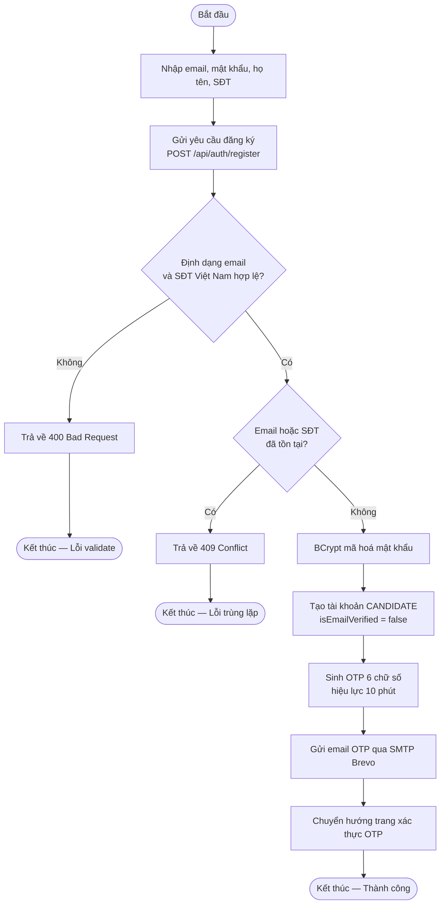

---

### UC-02: Đăng nhập

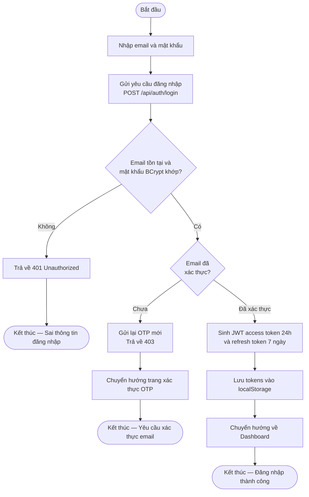

---

### UC-03: Xác thực Email (OTP)

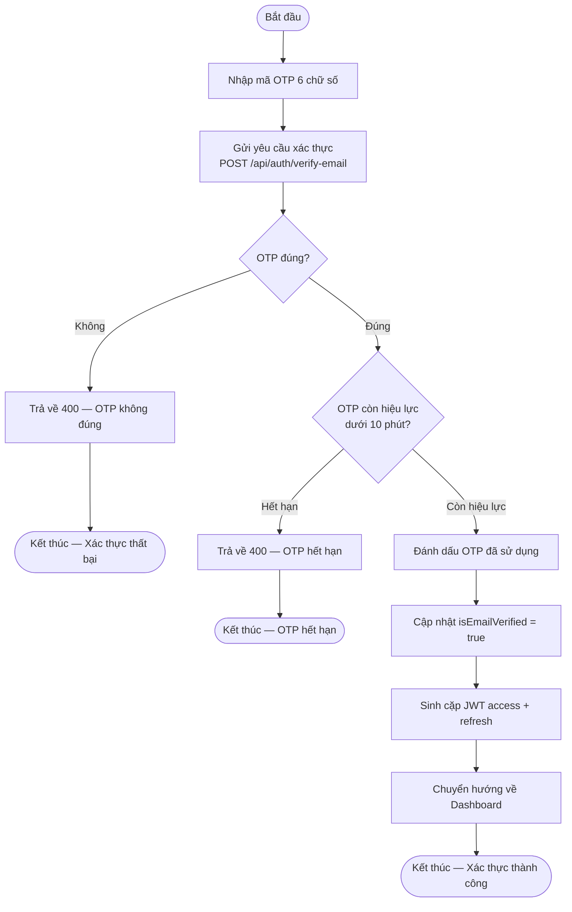

---

### UC-04: Gửi lại mã OTP

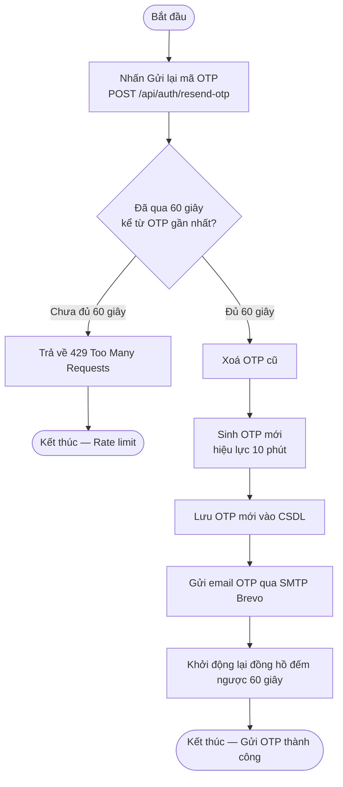

---

### UC-05: Quên mật khẩu

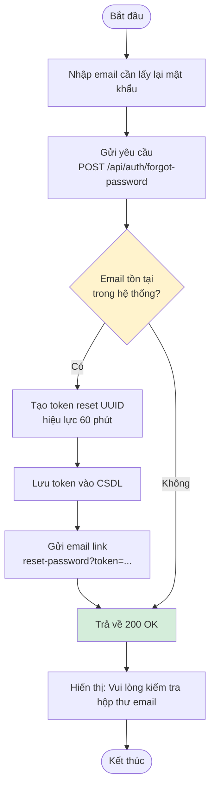

> **Lưu ý bảo mật:** Cả hai nhánh đều trả về 200 OK để tránh lộ thông tin email.

---

### UC-06: Đặt lại mật khẩu

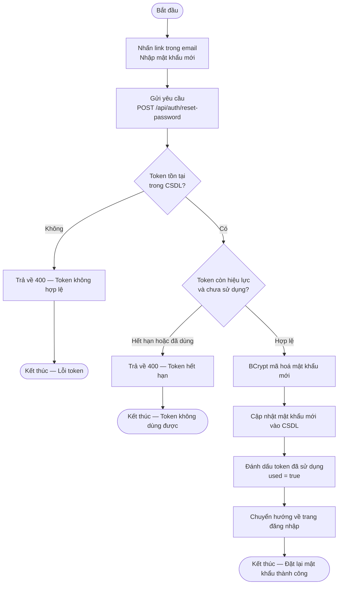

---

### UC-07: Đổi mật khẩu

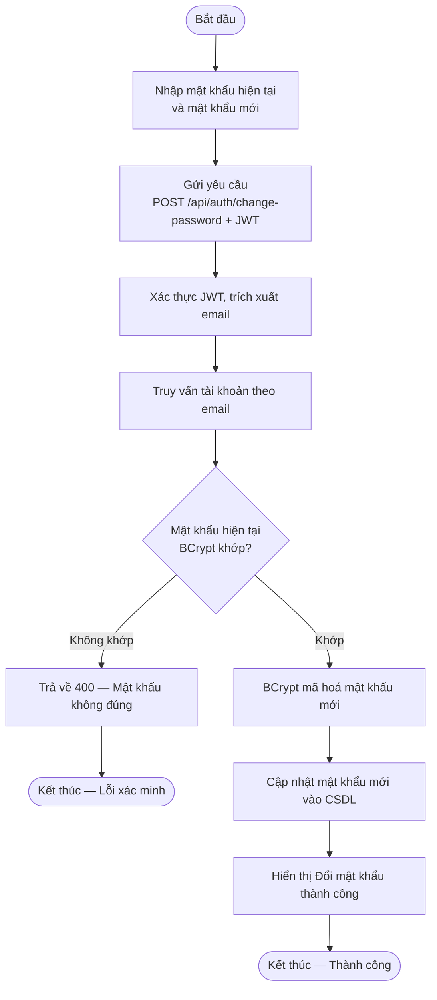

---

### UC-08: Làm mới Token

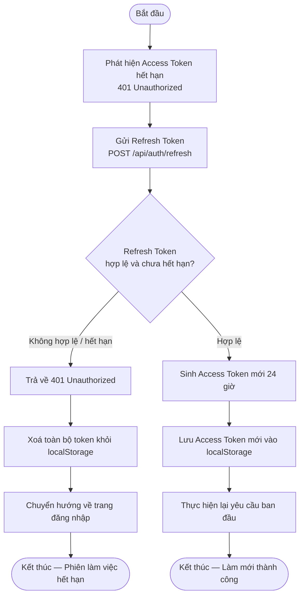

---

## Nhóm 2: Hồ sơ Cá nhân

### UC-09: Xem hồ sơ cá nhân

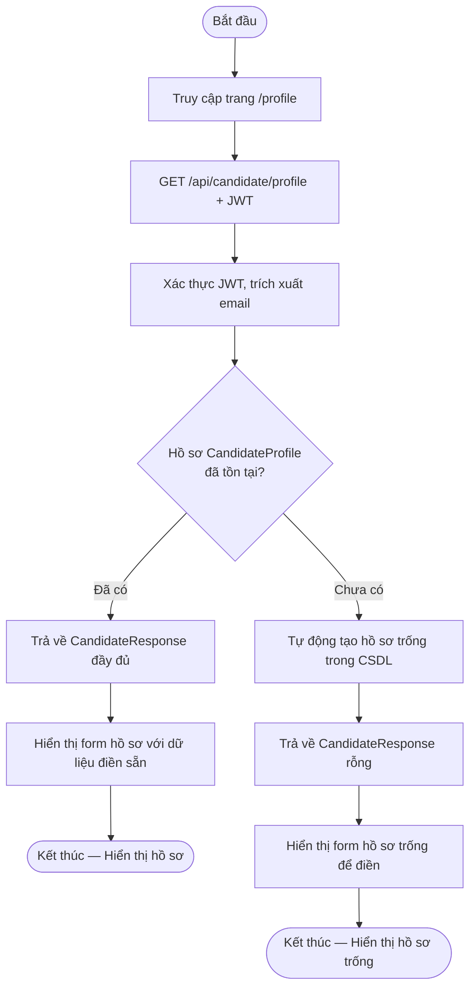

---

### UC-10: Cập nhật hồ sơ cá nhân

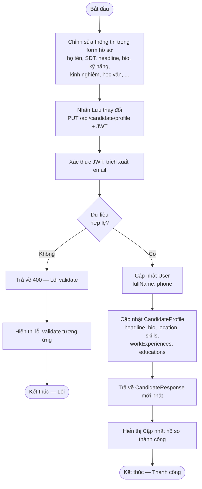

---

## Nhóm 3: Thư viện CV

### UC-11: Lưu CV vào thư viện

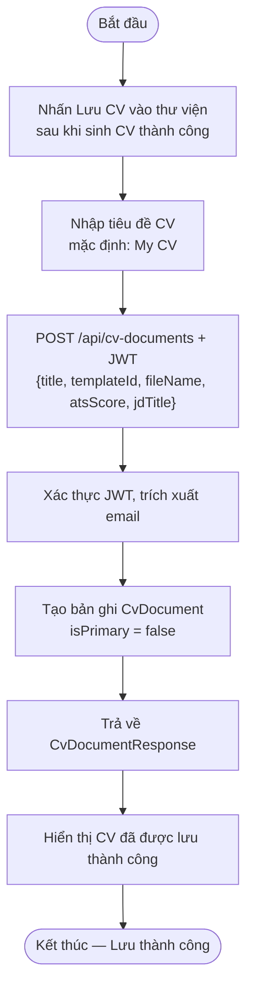

---

### UC-12: Xem thư viện CV

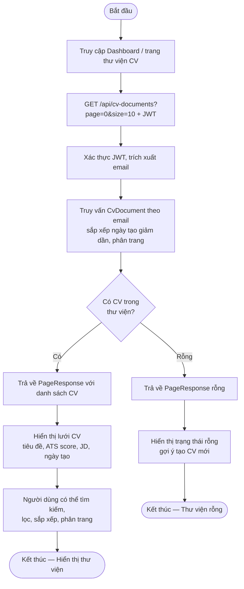

---

### UC-13: Đặt CV làm CV chính

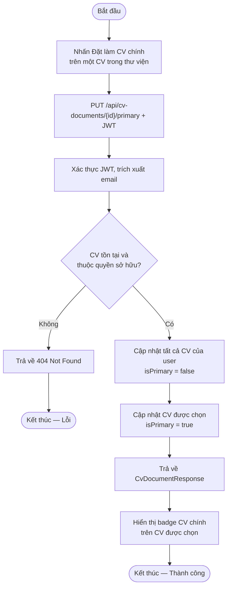

---

### UC-14: Xoá CV

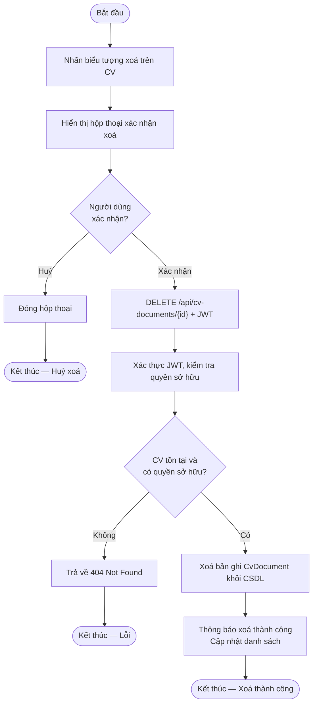

---

### UC-15: Tải xuống CV (DOCX)

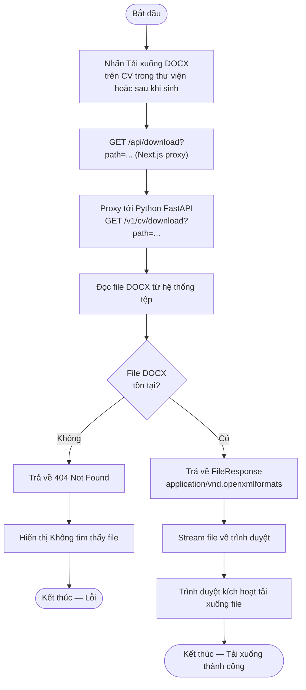

---

## Nhóm 4: Template CV & Tìm kiếm JD

### UC-16: Xem danh sách Template CV

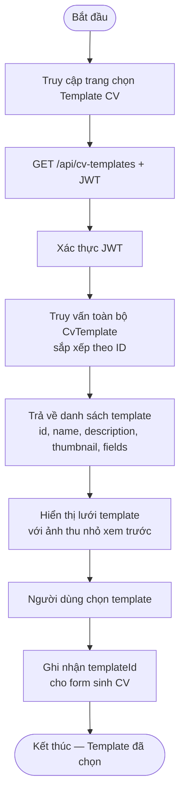

---

### UC-17: Tìm kiếm mô tả công việc

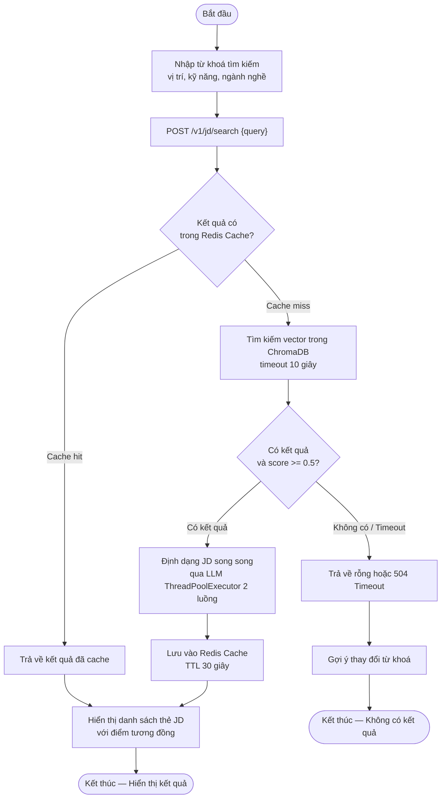

---

### UC-18: Xem chi tiết mô tả công việc

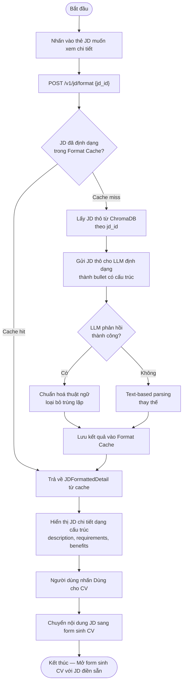

---

## Nhóm 5: Quản trị Admin

### UC-19: Xem Dashboard quản trị

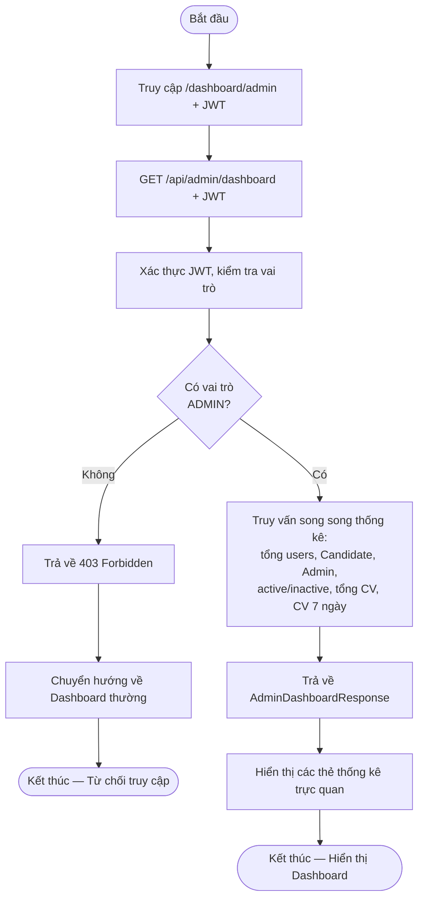

---

### UC-20a: Xem danh sách người dùng (Admin)

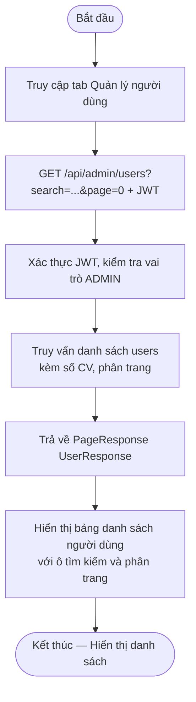

---

### UC-20b: Tạo người dùng mới (Admin)

```mermaid
flowchart TD
    A([Bắt đầu]) --> B["Nhấn Tạo mới\nĐiền email, mật khẩu, họ tên, vai trò"]
    B --> C["POST /api/admin/users + JWT"]
    C --> D["Xác thực JWT, kiểm tra vai trò ADMIN"]
    D --> E{"Email đã\ntồn tại?"}
    E -->|"Đã tồn tại"| F["Trả về 409 Conflict\nEmail đã được sử dụng"]
    F --> Z1(["Kết thúc — Lỗi trùng lặp"])
    E -->|"Chưa tồn tại"| G["BCrypt mã hoá mật khẩu"]
    G --> H["Tạo tài khoản với vai trò được chỉ định"]
    H --> I["Trả về 200 OK — UserResponse"]
    I --> J["Hiển thị thành công\nCập nhật danh sách"]
    J --> Z2(["Kết thúc — Tạo người dùng thành công"])
```

---

### UC-20c: Cập nhật thông tin người dùng (Admin)

```mermaid
flowchart TD
    A([Bắt đầu]) --> B["Chọn người dùng\nChỉnh sửa thông tin và nhấn Lưu"]
    B --> C["PUT /api/admin/users/{id} + JWT"]
    C --> D["Xác thực JWT, kiểm tra vai trò ADMIN"]
    D --> E{"Người dùng\ntồn tại?"}
    E -->|"Không"| F["Trả về 404 Not Found"]
    F --> Z1(["Kết thúc — Không tìm thấy"])
    E -->|"Có"| G{"Vi phạm ràng buộc bảo vệ?\nvd: Admin tự vô hiệu hoá bản thân"}
    G -->|"Có vi phạm"| H["Trả về 400 — Vi phạm ràng buộc"]
    H --> Z2(["Kết thúc — Lỗi ràng buộc"])
    G -->|"Không vi phạm"| I["Cập nhật thông tin người dùng"]
    I --> J["Trả về 200 OK — UserResponse"]
    J --> K["Hiển thị Cập nhật thành công"]
    K --> Z3(["Kết thúc — Cập nhật thành công"])
```

---

### UC-20d: Xoá người dùng (Admin)

```mermaid
flowchart TD
    A([Bắt đầu]) --> B["Nhấn xoá người dùng"]
    B --> C["Hiển thị hộp thoại xác nhận xoá"]
    C --> D{"Admin\nxác nhận?"}
    D -->|"Huỷ"| E["Đóng hộp thoại"]
    E --> Z1(["Kết thúc — Huỷ xoá"])
    D -->|"Xác nhận"| F["DELETE /api/admin/users/{id} + JWT"]
    F --> G["Xác thực JWT, kiểm tra vai trò ADMIN"]
    G --> H{"Admin đang\ntự xoá bản thân?"}
    H -->|"Có"| I["Trả về 400\nKhông thể tự xoá tài khoản"]
    I --> Z2(["Kết thúc — Lỗi ràng buộc"])
    H -->|"Không"| J["Xoá tài khoản và dữ liệu liên quan\ncascade delete"]
    J --> K["Thông báo xoá thành công\nCập nhật danh sách"]
    K --> Z3(["Kết thúc — Xoá thành công"])
```

---

### UC-21a: Xem danh sách Template CV (Admin)

```mermaid
flowchart TD
    A([Bắt đầu]) --> B["Truy cập tab Quản lý Template"]
    B --> C["GET /api/cv-templates?page=0 + JWT"]
    C --> D["Xác thực JWT, kiểm tra vai trò ADMIN"]
    D --> E["Truy vấn danh sách template\nphân trang"]
    E --> F["Trả về PageResponse CvTemplateResponse"]
    F --> G["Hiển thị bảng danh sách template"]
    G --> Z(["Kết thúc — Hiển thị danh sách template"])
```

---

### UC-21b: Tạo Template CV mới (Admin)

```mermaid
flowchart TD
    A([Bắt đầu]) --> B["Nhấn Tạo mới\nĐiền name, description, fields, thumbnail"]
    B --> C["POST /api/cv-templates + JWT"]
    C --> D["Xác thực JWT, kiểm tra vai trò ADMIN"]
    D --> E{"Dữ liệu\nhợp lệ?"}
    E -->|"Không"| F["Trả về 400 Bad Request"]
    F --> Z1(["Kết thúc — Lỗi validate"])
    E -->|"Có"| G["Lưu template mới vào CSDL"]
    G --> H["Trả về 200 OK — CvTemplateResponse"]
    H --> I["Hiển thị thành công\nCập nhật danh sách"]
    I --> Z2(["Kết thúc — Tạo template thành công"])
```

---

### UC-21c: Cập nhật Template CV (Admin)

```mermaid
flowchart TD
    A([Bắt đầu]) --> B["Chọn template\nChỉnh sửa và nhấn Lưu"]
    B --> C["PUT /api/cv-templates/{id} + JWT"]
    C --> D["Xác thực JWT, kiểm tra vai trò ADMIN"]
    D --> E{"Template\ntồn tại?"}
    E -->|"Không"| F["Trả về 404 Not Found"]
    F --> Z1(["Kết thúc — Không tìm thấy"])
    E -->|"Có"| G["Cập nhật thông tin template"]
    G --> H["Trả về 200 OK — CvTemplateResponse"]
    H --> I["Hiển thị Cập nhật thành công"]
    I --> Z2(["Kết thúc — Cập nhật thành công"])
```

---

### UC-21d: Xoá Template CV (Admin)

```mermaid
flowchart TD
    A([Bắt đầu]) --> B["Nhấn xoá template"]
    B --> C["Hiển thị hộp thoại xác nhận xoá"]
    C --> D{"Admin\nxác nhận?"}
    D -->|"Huỷ"| E["Đóng hộp thoại"]
    E --> Z1(["Kết thúc — Huỷ xoá"])
    D -->|"Xác nhận"| F["DELETE /api/cv-templates/{id} + JWT"]
    F --> G["Xác thực JWT, kiểm tra vai trò ADMIN"]
    G --> H{"Template\ntồn tại?"}
    H -->|"Không"| I["Trả về 404 Not Found"]
    I --> Z2(["Kết thúc — Lỗi"])
    H -->|"Có"| J["Xoá template khỏi CSDL"]
    J --> K["Thông báo xoá thành công\nCập nhật danh sách"]
    K --> Z3(["Kết thúc — Xoá thành công"])
```

---

## Nhóm 6: AI Pipeline

### UC-22: Sinh CV bằng AI

```mermaid
flowchart TD
    A([Bắt đầu]) --> B["Nhập JD, hồ sơ cá nhân\nchọn template và ngôn ngữ"]
    B --> C["POST /v1/cv/generate hoặc /generate/async"]
    C --> D["Khởi động LangGraph Pipeline"]
    D --> E["jd_analyzer_node\nPhân tích JD trích xuất yêu cầu"]
    E --> F["profile_normalizer_node\nChuẩn hoá hồ sơ người dùng"]
    F --> G["summary_agent_node\nSinh tóm tắt chuyên nghiệp + RAG"]
    G --> H["experience_agent_node\nViết bullet STAR song song"]
    H --> I["skills_agent_node\nPhân loại và sắp xếp kỹ năng"]
    I --> J["qc_agent_node\nKiểm định chất lượng ATS + JD Match + Linguistic"]
    J --> K{"Điểm >= 7.0\nhoặc hết lượt sửa?"}
    K -->|"Không — còn lượt sửa"| G
    K -->|"Có"| L{"Có template\nđược chọn?"}
    L -->|"Có"| M["template_renderer_node\nRender DOCX theo template"]
    M --> N["Lưu file cv_timestamp.docx\nvào thư mục outputs/"]
    N --> O["Trả về CVGenerateResponse\noutput_path, quality_score, cv_draft"]
    O --> P["Hiển thị xem trước CV\nvà điểm chất lượng"]
    P --> Z1(["Kết thúc — Sinh CV thành công"])
    L -->|"Không"| Q["Trả về cv_draft và quality_score\nkhông có file DOCX"]
    Q --> Z2(["Kết thúc — Không có file xuất"])
    D -->|"Pipeline lỗi"| R["Trả về 500 — Lỗi sinh CV"]
    R --> S["Gợi ý người dùng thử lại"]
    S --> Z3(["Kết thúc — Lỗi pipeline"])
```

---

### UC-23: Tác nhân Phân tích JD

```mermaid
flowchart TD
    A([Bắt đầu]) --> B["Nhận state.job_description\ntừ LangGraph Pipeline"]
    B --> C["Gửi prompt trích xuất có cấu trúc\ntới LLM tier cheap"]
    C --> D{"LLM trích xuất\nthành công?"}
    D -->|"Có"| E["Nhận JobRequirement:\njob_title, required_skills,\npreferred_skills, keywords,\nindustry, seniority_level"]
    E --> F["Lưu JobRequirement vào state"]
    F --> G["Ghi log: jd_analyzer — Analyzed job_title"]
    G --> H["Chuyển sang profile_normalizer_node"]
    H --> Z1(["Kết thúc — Phân tích JD thành công"])
    D -->|"Không"| I["Lưu JobRequirement rỗng vào state"]
    I --> J["Ghi log cảnh báo"]
    J --> K["Tiếp tục pipeline với dữ liệu rỗng"]
    K --> Z2(["Kết thúc — Không trích xuất được JD"])
```

---

### UC-24: Tác nhân Sinh tóm tắt

```mermaid
flowchart TD
    A([Bắt đầu]) --> B["Nhận user_profile\nvà job_requirement từ state"]
    B --> C["Truy vấn ChromaDB RAG\nví dụ tóm tắt tương đồng\ntheo job_title, industry, seniority"]
    C --> D{"Có ví dụ RAG\nphù hợp?"}
    D -->|"Có"| E["Sử dụng ví dụ tương đồng\nlàm context cho LLM"]
    D -->|"Không"| F["Tiếp tục không có RAG context"]
    E --> G["Xây dựng prompt đầy đủ:\nuser_profile + JD + RAG + QC feedback"]
    F --> G
    G --> H["Gửi tới LLM tier strong\nSinh tóm tắt 3-4 câu, 50-80 từ\nngôn ngữ vi/en"]
    H --> I["Nhận đoạn tóm tắt chuyên nghiệp"]
    I --> J["Lưu vào state.cv_draft.summary"]
    J --> Z(["Kết thúc — Tóm tắt đã được sinh"])
```

---

### UC-25: Tác nhân Viết bullet kinh nghiệm

```mermaid
flowchart TD
    A([Bắt đầu]) --> B["Nhận work_experiences[]\nvà job_requirement từ state"]
    B --> C["Khởi động ThreadPoolExecutor\ntối đa 4 luồng song song"]
    C --> D["Phân phối mỗi vị trí làm việc\ncho một luồng xử lý"]

    D --> E1["Luồng 1: Vị trí làm việc 1\nTruy vấn RAG ví dụ bullet"]
    D --> E2["Luồng 2: Vị trí làm việc 2\nTruy vấn RAG ví dụ bullet"]
    D --> E3["Luồng N: Vị trí làm việc N\nTruy vấn RAG ví dụ bullet"]

    E1 --> F1["LLM sinh 3-5 bullet STAR\nđộng từ mạnh + từ khoá JD"]
    E2 --> F2["LLM sinh 3-5 bullet STAR\nđộng từ mạnh + từ khoá JD"]
    E3 --> F3["LLM sinh 3-5 bullet STAR\nđộng từ mạnh + từ khoá JD"]

    F1 --> G["Tổng hợp kết quả tất cả luồng"]
    F2 --> G
    F3 --> G

    G --> H["Lưu vào state.cv_draft.experiences"]
    H --> Z(["Kết thúc — Bullet kinh nghiệm đã viết"])
```

---

### UC-26: Tác nhân Phân loại kỹ năng

```mermaid
flowchart TD
    A([Bắt đầu]) --> B["Nhận skills_raw[]\nvà job_requirement.required_skills[] từ state"]
    B --> C["Gửi toàn bộ kỹ năng thô\nvà yêu cầu JD tới LLM tier cheap"]
    C --> D["LLM phân loại kỹ năng:\nNgôn ngữ lập trình, Frameworks,\nDatabases, DevOps, Tools, Kỹ năng mềm"]
    D --> E["Sắp xếp kỹ năng khớp JD\nlên đầu mỗi nhóm"]
    E --> F["Gộp kỹ năng tương đương\nvd: JS → JavaScript"]
    F --> G["Lưu vào state.cv_draft.skills_categorized"]
    G --> Z(["Kết thúc — Kỹ năng đã phân loại"])
```

---

### UC-27: Tác nhân Kiểm định chất lượng CV

```mermaid
flowchart TD
    A([Bắt đầu]) --> B["Nhận cv_draft và job_requirement từ state"]
    B --> C["Gửi tới LLM tier cheap\nChấm điểm 3 tiêu chí thang 0-10"]
    C --> D["Nhận điểm:\nATS_SCORE = từ khoá 40% + cấu trúc 30% + thuật ngữ 30%\nJD_MATCH = kinh nghiệm 40% + kỹ năng 30% + tóm tắt 20% + cấp độ 10%\nLINGUISTIC = STAR 40% + động từ 20% + ngữ pháp 20% + không sáo 20%"]
    D --> E["Tính OVERALL = trung bình 3 tiêu chí"]
    E --> F["Tăng revision_count lên 1"]
    F --> G["Lưu QualityScore vào state"]
    G --> H{"OVERALL >= 7.0\nhoặc revision_count > max_revisions?"}
    H -->|"Có"| I{"Có template\nđược chọn?"}
    I -->|"Có"| J["Chuyển sang template_renderer_node"]
    J --> Z1(["Kết thúc — Chuyển render template"])
    I -->|"Không"| K["Kết thúc pipeline\nkhông có file xuất"]
    K --> Z2(["Kết thúc — Pipeline hoàn thành không file"])
    H -->|"Không — còn lượt sửa"| L["Quay lại summary_agent_node\nvòng lặp sửa đổi"]
    L --> Z3(["Kết thúc — Tiếp tục vòng lặp sửa"])
```

---

### UC-28: Tác nhân Render Template DOCX

```mermaid
flowchart TD
    A([Bắt đầu]) --> B["Nhận cv_draft, user_profile\nvà template_path từ state"]
    B --> C["Đọc file DOCX template\ntừ hệ thống tệp"]
    C --> D{"File template\ntồn tại?"}
    D -->|"Không"| E["Ghi lỗi vào nhật ký"]
    E --> Z1(["Kết thúc — Lỗi không có file template"])
    D -->|"Có"| F{"Loại template?"}
    F -->|"a Có FIELD_NAME\nplaceholder"| G["Ánh xạ placeholder\nvới trường CV"]
    G --> G1["Điền thông tin cá nhân\nvà xây dựng sections"]
    G1 --> G2["Chèn ảnh nếu supportsPhotoUpload"]
    G2 --> J
    F -->|"b Template định sẵn\nID 1-5"| H["Dùng ánh xạ vị trí đoạn văn\nmã hoá cứng"]
    H --> J
    F -->|"c Template mẫu exemplar"| I["Gửi template cho LLM\nPhát hiện sections"]
    I --> I1["LLM trả về danh sách sections"]
    I1 --> I2["Điền nội dung và bổ sung\nsection còn thiếu"]
    I2 --> J
    J["Lưu file cv_timestamp.docx\nvào thư mục outputs/"] --> K["Lưu output_path vào state"]
    K --> Z2(["Kết thúc — Render DOCX thành công"])
```

---

### UC-29: Xây dựng chỉ mục RAG

```mermaid
flowchart TD
    A([Bắt đầu]) --> B["Admin gọi\nPOST /v1/cv/rag/build\n{source, reset, max_records, include_seed}"]
    B --> C{"Có tiến trình build\nRAG đang chạy?"}
    C -->|"Đang chạy"| D["Trả về 409 Conflict\nRAG build đang chạy"]
    D --> Z1(["Kết thúc — Từ chối xung đột"])
    C -->|"Không"| E["Trả về 202 Accepted ngay lập tức"]
    E --> F["Khởi động Background Task"]
    F --> G{"Nguồn dữ liệu\nsource?"}
    G -->|"source = seed"| H["Nạp ví dụ CV\ntuyển chọn thủ công từ Seed Data"]
    H --> I["Lập chỉ mục Seed data\nvào ChromaDB"]
    G -->|"source = hf"| J["Tải dataset từ HuggingFace"]
    J --> K["Lập chỉ mục hàng loạt\nHuggingFace embeddings vào ChromaDB"]
    I --> L["Ghi kết quả build\nsố bản ghi, thời gian hoàn thành"]
    K --> L
    L --> M["Background Task hoàn thành"]
    M --> N["Admin polling\nGET /v1/cv/rag/build/status"]
    N --> O["Trả về trạng thái hoàn thành"]
    O --> P["Admin truy vấn thống kê\nGET /v1/cv/rag/stats"]
    P --> Q["ChromaDB trả về\ncollection_count, total_embeddings"]
    Q --> Z2(["Kết thúc — RAG Index đã xây dựng"])
```

---

*Tài liệu này được tạo tự động dựa trên phân tích 29 use case của hệ thống CVCraft.*  
*Cập nhật lần cuối: 2026-05-24*
