# CVCraft - Toàn bộ Sequence Diagrams (29 Use Cases)

## UC-01: Đăng ký tài khoản

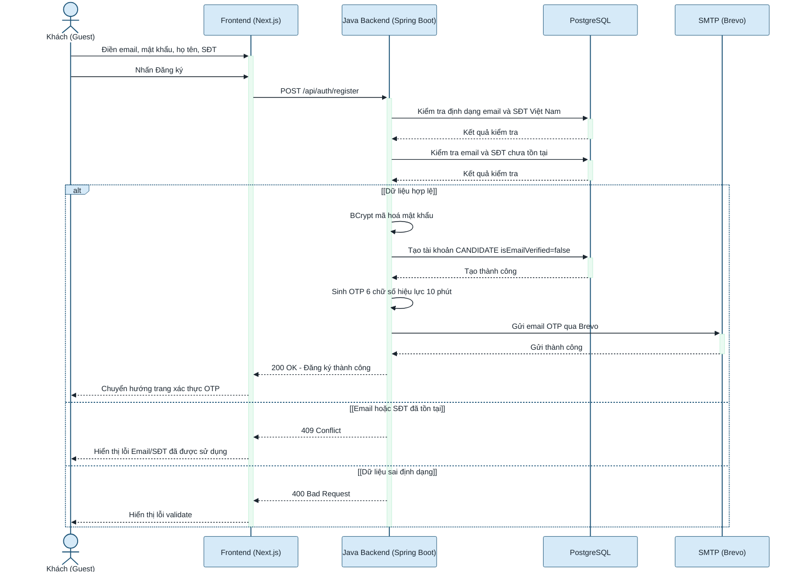
```mermaid
%%{init: {"theme": "base", "themeVariables": {"fontSize": "20px", "lineColor": "#2c3e50", "primaryColor": "#d6eaf8", "primaryBorderColor": "#1a5276", "primaryTextColor": "#1a252f", "secondaryColor": "#eafaf1", "tertiaryColor": "#fdfefe"}, "sequence": {"actorMargin": 80, "width": 200, "height": 65, "messageMargin": 35}}}%%
sequenceDiagram
    actor Khach as Khách (Guest)
    participant FE as Frontend (Next.js)
    participant BE as Java Backend (Spring Boot)
    participant DB as PostgreSQL
    participant SMTP as SMTP (Brevo)

    Khach->>+FE: Điền email, mật khẩu, họ tên, SĐT
    Khach->>FE: Nhấn Đăng ký
    FE->>+BE: POST /api/auth/register
    BE->>+DB: Kiểm tra định dạng email và SĐT Việt Nam
    DB-->>-BE: Kết quả kiểm tra
    BE->>+DB: Kiểm tra email và SĐT chưa tồn tại
    DB-->>-BE: Kết quả kiểm tra

    alt [Dữ liệu hợp lệ]
        BE->>BE: BCrypt mã hoá mật khẩu
        BE->>+DB: Tạo tài khoản CANDIDATE isEmailVerified=false
        DB-->>-BE: Tạo thành công
        BE->>BE: Sinh OTP 6 chữ số hiệu lực 10 phút
        BE->>+SMTP: Gửi email OTP qua Brevo
        SMTP-->>-BE: Gửi thành công
        BE-->>FE: 200 OK - Đăng ký thành công
        FE-->>Khach: Chuyển hướng trang xác thực OTP
    else [Email hoặc SĐT đã tồn tại]
        BE-->>FE: 409 Conflict
        FE-->>Khach: Hiển thị lỗi Email/SĐT đã được sử dụng
    else [Dữ liệu sai định dạng]
        BE-->>FE: 400 Bad Request
        FE-->>Khach: Hiển thị lỗi validate
    end
    deactivate BE
    deactivate FE
```

## UC-02: Đăng nhập

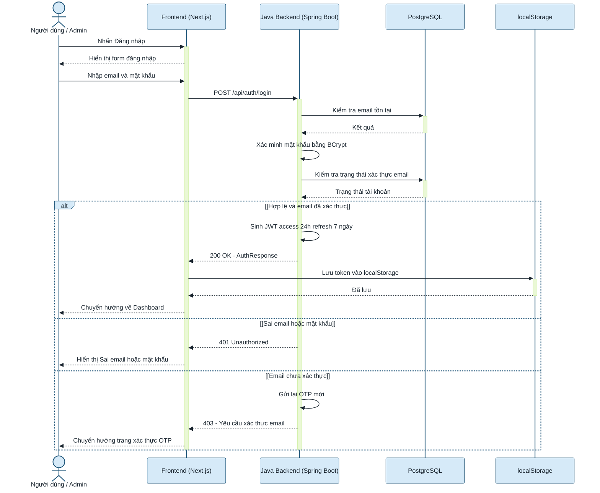
```mermaid
%%{init: {"theme": "base", "themeVariables": {"fontSize": "20px", "lineColor": "#2c3e50", "primaryColor": "#d6eaf8", "primaryBorderColor": "#1a5276", "primaryTextColor": "#1a252f"}, "sequence": {"actorMargin": 80, "width": 200, "height": 65, "messageMargin": 35}}}%%
sequenceDiagram
    actor ND as Người dùng / Admin
    participant FE as Frontend (Next.js)
    participant BE as Java Backend (Spring Boot)
    participant DB as PostgreSQL
    participant LS as localStorage

    ND->>+FE: Nhấn Đăng nhập
    FE-->>ND: Hiển thị form đăng nhập
    ND->>FE: Nhập email và mật khẩu
    FE->>+BE: POST /api/auth/login
    BE->>+DB: Kiểm tra email tồn tại
    DB-->>-BE: Kết quả
    BE->>BE: Xác minh mật khẩu bằng BCrypt
    BE->>+DB: Kiểm tra trạng thái xác thực email
    DB-->>-BE: Trạng thái tài khoản

    alt [Hợp lệ và email đã xác thực]
        BE->>BE: Sinh JWT access 24h refresh 7 ngày
        BE-->>FE: 200 OK - AuthResponse
        FE->>+LS: Lưu token vào localStorage
        LS-->>-FE: Đã lưu
        FE-->>ND: Chuyển hướng về Dashboard
    else [Sai email hoặc mật khẩu]
        BE-->>FE: 401 Unauthorized
        FE-->>ND: Hiển thị Sai email hoặc mật khẩu
    else [Email chưa xác thực]
        BE->>BE: Gửi lại OTP mới
        BE-->>FE: 403 - Yêu cầu xác thực email
        FE-->>ND: Chuyển hướng trang xác thực OTP
    end
    deactivate BE
    deactivate FE
```

## UC-03: Xác thực Email (OTP)

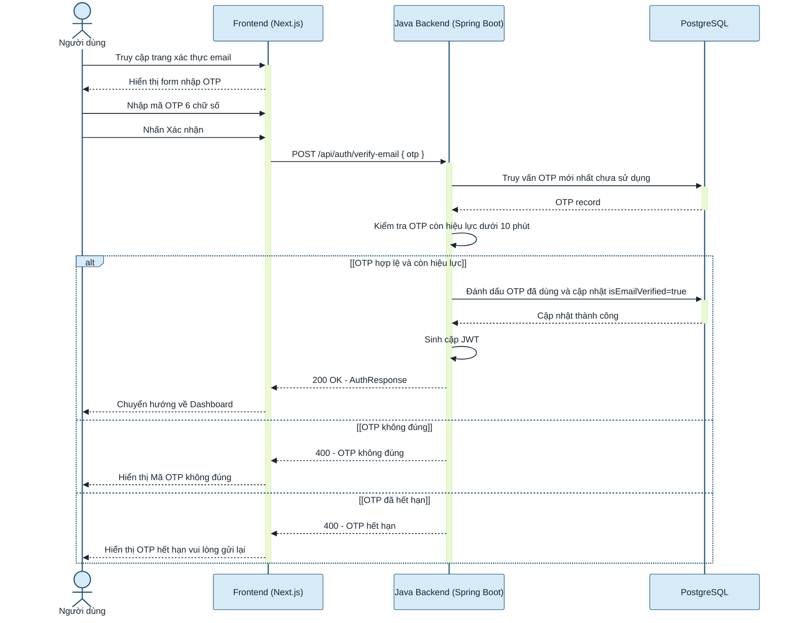
```mermaid
%%{init: {"theme": "base", "themeVariables": {"fontSize": "20px", "lineColor": "#2c3e50", "primaryColor": "#d6eaf8", "primaryBorderColor": "#1a5276", "primaryTextColor": "#1a252f"}, "sequence": {"actorMargin": 80, "width": 200, "height": 65, "messageMargin": 35}}}%%
sequenceDiagram
    actor ND as Người dùng
    participant FE as Frontend (Next.js)
    participant BE as Java Backend (Spring Boot)
    participant DB as PostgreSQL

    ND->>+FE: Truy cập trang xác thực email
    FE-->>ND: Hiển thị form nhập OTP
    ND->>FE: Nhập mã OTP 6 chữ số
    ND->>FE: Nhấn Xác nhận
    FE->>+BE: POST /api/auth/verify-email { otp }
    BE->>+DB: Truy vấn OTP mới nhất chưa sử dụng
    DB-->>-BE: OTP record
    BE->>BE: Kiểm tra OTP còn hiệu lực dưới 10 phút

    alt [OTP hợp lệ và còn hiệu lực]
        BE->>+DB: Đánh dấu OTP đã dùng và cập nhật isEmailVerified=true
        DB-->>-BE: Cập nhật thành công
        BE->>BE: Sinh cặp JWT
        BE-->>FE: 200 OK - AuthResponse
        FE-->>ND: Chuyển hướng về Dashboard
    else [OTP không đúng]
        BE-->>FE: 400 - OTP không đúng
        FE-->>ND: Hiển thị Mã OTP không đúng
    else [OTP đã hết hạn]
        BE-->>FE: 400 - OTP hết hạn
        FE-->>ND: Hiển thị OTP hết hạn vui lòng gửi lại
    end
    deactivate BE
    deactivate FE
```

## UC-04: Gửi lại mã OTP

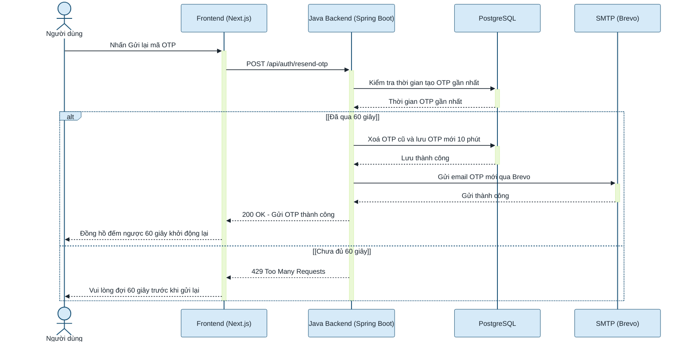
```mermaid
%%{init: {"theme": "base", "themeVariables": {"fontSize": "20px", "lineColor": "#2c3e50", "primaryColor": "#d6eaf8", "primaryBorderColor": "#1a5276", "primaryTextColor": "#1a252f"}, "sequence": {"actorMargin": 80, "width": 200, "height": 65, "messageMargin": 35}}}%%
sequenceDiagram
    actor ND as Người dùng
    participant FE as Frontend (Next.js)
    participant BE as Java Backend (Spring Boot)
    participant DB as PostgreSQL
    participant SMTP as SMTP (Brevo)

    ND->>+FE: Nhấn Gửi lại mã OTP
    FE->>+BE: POST /api/auth/resend-otp
    BE->>+DB: Kiểm tra thời gian tạo OTP gần nhất
    DB-->>-BE: Thời gian OTP gần nhất

    alt [Đã qua 60 giây]
        BE->>+DB: Xoá OTP cũ và lưu OTP mới 10 phút
        DB-->>-BE: Lưu thành công
        BE->>+SMTP: Gửi email OTP mới qua Brevo
        SMTP-->>-BE: Gửi thành công
        BE-->>FE: 200 OK - Gửi OTP thành công
        FE-->>ND: Đồng hồ đếm ngược 60 giây khởi động lại
    else [Chưa đủ 60 giây]
        BE-->>FE: 429 Too Many Requests
        FE-->>ND: Vui lòng đợi 60 giây trước khi gửi lại
    end
    deactivate BE
    deactivate FE
```

## UC-05 & UC-06: Quên mật khẩu và Đặt lại mật khẩu

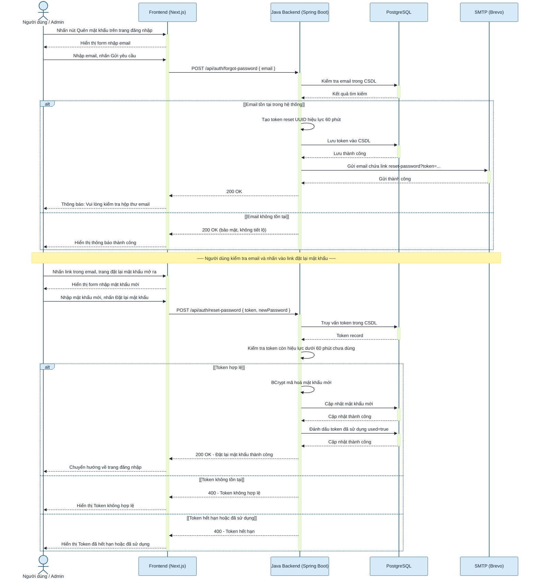
```mermaid
%%{init: {"theme": "base", "themeVariables": {"fontSize": "20px", "lineColor": "#2c3e50", "primaryColor": "#d6eaf8", "primaryBorderColor": "#1a5276", "primaryTextColor": "#1a252f"}, "sequence": {"actorMargin": 80, "width": 200, "height": 65, "messageMargin": 35}}}%%
sequenceDiagram
    actor ND as Người dùng / Admin
    participant FE as Frontend (Next.js)
    participant BE as Java Backend (Spring Boot)
    participant DB as PostgreSQL
    participant SMTP as SMTP (Brevo)

    ND->>+FE: Nhấn nút Quên mật khẩu trên trang đăng nhập
    FE-->>ND: Hiển thị form nhập email
    ND->>FE: Nhập email, nhấn Gửi yêu cầu
    FE->>+BE: POST /api/auth/forgot-password { email }
    BE->>+DB: Kiểm tra email trong CSDL
    DB-->>-BE: Kết quả tìm kiếm

    alt [Email tồn tại trong hệ thống]
        BE->>BE: Tạo token reset UUID hiệu lực 60 phút
        BE->>+DB: Lưu token vào CSDL
        DB-->>-BE: Lưu thành công
        BE->>+SMTP: Gửi email chứa link reset-password?token=...
        SMTP-->>-BE: Gửi thành công
        BE-->>FE: 200 OK
        FE-->>ND: Thông báo: Vui lòng kiểm tra hộp thư email
    else [Email không tồn tại]
        BE-->>FE: 200 OK (bảo mật, không tiết lộ)
        FE-->>ND: Hiển thị thông báo thành công
    end
    deactivate BE
    deactivate FE

    Note over ND,SMTP: ── Người dùng kiểm tra email và nhấn vào link đặt lại mật khẩu ──

    ND->>+FE: Nhấn link trong email, trang đặt lại mật khẩu mở ra
    FE-->>ND: Hiển thị form nhập mật khẩu mới
    ND->>FE: Nhập mật khẩu mới, nhấn Đặt lại mật khẩu
    FE->>+BE: POST /api/auth/reset-password { token, newPassword }
    BE->>+DB: Truy vấn token trong CSDL
    DB-->>-BE: Token record
    BE->>BE: Kiểm tra token còn hiệu lực dưới 60 phút chưa dùng

    alt [Token hợp lệ]
        BE->>BE: BCrypt mã hoá mật khẩu mới
        BE->>+DB: Cập nhật mật khẩu mới
        DB-->>-BE: Cập nhật thành công
        BE->>+DB: Đánh dấu token đã sử dụng used=true
        DB-->>-BE: Cập nhật thành công
        BE-->>FE: 200 OK - Đặt lại mật khẩu thành công
        FE-->>ND: Chuyển hướng về trang đăng nhập
    else [Token không tồn tại]
        BE-->>FE: 400 - Token không hợp lệ
        FE-->>ND: Hiển thị Token không hợp lệ
    else [Token hết hạn hoặc đã sử dụng]
        BE-->>FE: 400 - Token hết hạn
        FE-->>ND: Hiển thị Token đã hết hạn hoặc đã sử dụng
    end
    deactivate BE
    deactivate FE
```

## UC-07: Đổi mật khẩu

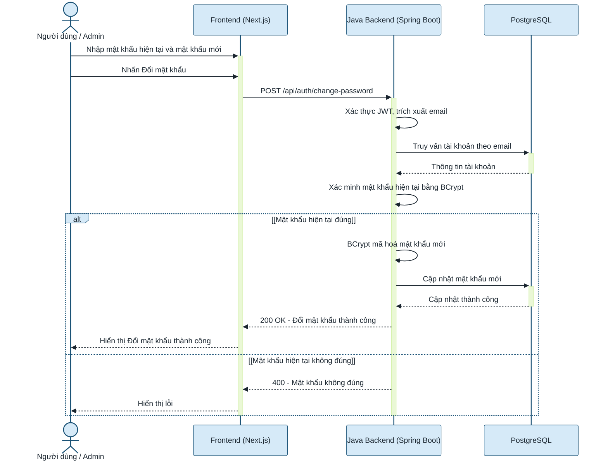
```mermaid
%%{init: {"theme": "base", "themeVariables": {"fontSize": "20px", "lineColor": "#2c3e50", "primaryColor": "#d6eaf8", "primaryBorderColor": "#1a5276", "primaryTextColor": "#1a252f"}, "sequence": {"actorMargin": 80, "width": 200, "height": 65, "messageMargin": 35}}}%%
sequenceDiagram
    actor ND as Người dùng / Admin
    participant FE as Frontend (Next.js)
    participant BE as Java Backend (Spring Boot)
    participant DB as PostgreSQL

    ND->>+FE: Nhập mật khẩu hiện tại và mật khẩu mới
    ND->>FE: Nhấn Đổi mật khẩu
    FE->>+BE: POST /api/auth/change-password
    BE->>BE: Xác thực JWT, trích xuất email
    BE->>+DB: Truy vấn tài khoản theo email
    DB-->>-BE: Thông tin tài khoản
    BE->>BE: Xác minh mật khẩu hiện tại bằng BCrypt

    alt [Mật khẩu hiện tại đúng]
        BE->>BE: BCrypt mã hoá mật khẩu mới
        BE->>+DB: Cập nhật mật khẩu mới
        DB-->>-BE: Cập nhật thành công
        BE-->>FE: 200 OK - Đổi mật khẩu thành công
        FE-->>ND: Hiển thị Đổi mật khẩu thành công
    else [Mật khẩu hiện tại không đúng]
        BE-->>FE: 400 - Mật khẩu không đúng
        FE-->>ND: Hiển thị lỗi
    end
    deactivate BE
    deactivate FE
```

## UC-08: Làm mới Token

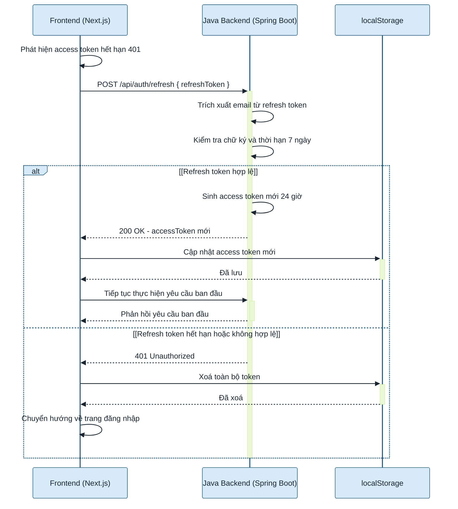
```mermaid
%%{init: {"theme": "base", "themeVariables": {"fontSize": "20px", "lineColor": "#2c3e50", "primaryColor": "#d6eaf8", "primaryBorderColor": "#1a5276", "primaryTextColor": "#1a252f"}, "sequence": {"actorMargin": 80, "width": 200, "height": 65, "messageMargin": 35}}}%%
sequenceDiagram
    participant FE as Frontend (Next.js)
    participant BE as Java Backend (Spring Boot)
    participant LS as localStorage

    FE->>FE: Phát hiện access token hết hạn 401
    FE->>+BE: POST /api/auth/refresh { refreshToken }
    BE->>BE: Trích xuất email từ refresh token
    BE->>BE: Kiểm tra chữ ký và thời hạn 7 ngày

    alt [Refresh token hợp lệ]
        BE->>BE: Sinh access token mới 24 giờ
        BE-->>FE: 200 OK - accessToken mới
        FE->>+LS: Cập nhật access token mới
        LS-->>-FE: Đã lưu
        FE->>+BE: Tiếp tục thực hiện yêu cầu ban đầu
        BE-->>-FE: Phản hồi yêu cầu ban đầu
    else [Refresh token hết hạn hoặc không hợp lệ]
        BE-->>FE: 401 Unauthorized
        FE->>+LS: Xoá toàn bộ token
        LS-->>-FE: Đã xoá
        FE->>FE: Chuyển hướng về trang đăng nhập
    end
    deactivate BE
```

## UC-09: Xem hồ sơ cá nhân

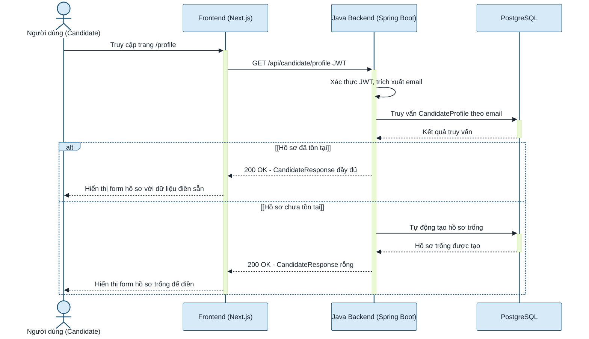
```mermaid
%%{init: {"theme": "base", "themeVariables": {"fontSize": "20px", "lineColor": "#2c3e50", "primaryColor": "#d6eaf8", "primaryBorderColor": "#1a5276", "primaryTextColor": "#1a252f"}, "sequence": {"actorMargin": 80, "width": 200, "height": 65, "messageMargin": 35}}}%%
sequenceDiagram
    actor ND as Người dùng (Candidate)
    participant FE as Frontend (Next.js)
    participant BE as Java Backend (Spring Boot)
    participant DB as PostgreSQL

    ND->>+FE: Truy cập trang /profile
    FE->>+BE: GET /api/candidate/profile JWT
    BE->>BE: Xác thực JWT, trích xuất email
    BE->>+DB: Truy vấn CandidateProfile theo email
    DB-->>-BE: Kết quả truy vấn

    alt [Hồ sơ đã tồn tại]
        BE-->>FE: 200 OK - CandidateResponse đầy đủ
        FE-->>ND: Hiển thị form hồ sơ với dữ liệu điền sẵn
    else [Hồ sơ chưa tồn tại]
        BE->>+DB: Tự động tạo hồ sơ trống
        DB-->>-BE: Hồ sơ trống được tạo
        BE-->>FE: 200 OK - CandidateResponse rỗng
        FE-->>ND: Hiển thị form hồ sơ trống để điền
    end
    deactivate BE
    deactivate FE
```

## UC-10: Cập nhật hồ sơ cá nhân

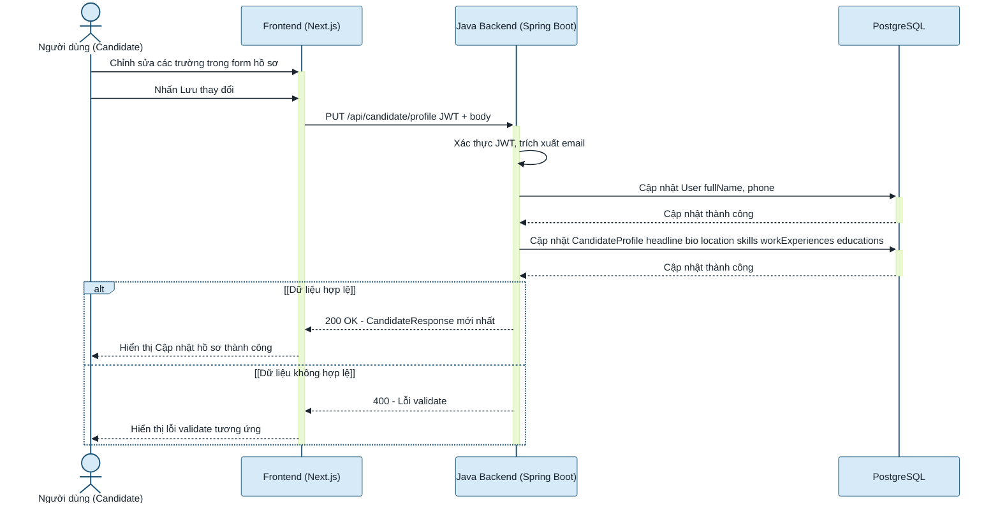
```mermaid
%%{init: {"theme": "base", "themeVariables": {"fontSize": "20px", "lineColor": "#2c3e50", "primaryColor": "#d6eaf8", "primaryBorderColor": "#1a5276", "primaryTextColor": "#1a252f"}, "sequence": {"actorMargin": 80, "width": 200, "height": 65, "messageMargin": 35}}}%%
sequenceDiagram
    actor ND as Người dùng (Candidate)
    participant FE as Frontend (Next.js)
    participant BE as Java Backend (Spring Boot)
    participant DB as PostgreSQL

    ND->>+FE: Chỉnh sửa các trường trong form hồ sơ
    ND->>FE: Nhấn Lưu thay đổi
    FE->>+BE: PUT /api/candidate/profile JWT + body
    BE->>BE: Xác thực JWT, trích xuất email
    BE->>+DB: Cập nhật User fullName, phone
    DB-->>-BE: Cập nhật thành công
    BE->>+DB: Cập nhật CandidateProfile headline bio location skills workExperiences educations
    DB-->>-BE: Cập nhật thành công

    alt [Dữ liệu hợp lệ]
        BE-->>FE: 200 OK - CandidateResponse mới nhất
        FE-->>ND: Hiển thị Cập nhật hồ sơ thành công
    else [Dữ liệu không hợp lệ]
        BE-->>FE: 400 - Lỗi validate
        FE-->>ND: Hiển thị lỗi validate tương ứng
    end
    deactivate BE
    deactivate FE
```

## UC-11: Lưu CV vào thư viện

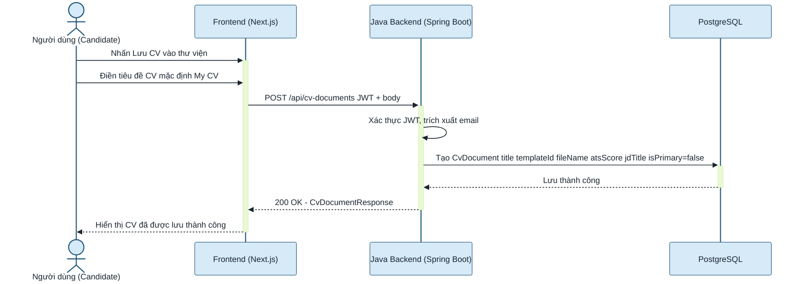
```mermaid
%%{init: {"theme": "base", "themeVariables": {"fontSize": "20px", "lineColor": "#2c3e50", "primaryColor": "#d6eaf8", "primaryBorderColor": "#1a5276", "primaryTextColor": "#1a252f"}, "sequence": {"actorMargin": 80, "width": 200, "height": 65, "messageMargin": 35}}}%%
sequenceDiagram
    actor ND as Người dùng (Candidate)
    participant FE as Frontend (Next.js)
    participant BE as Java Backend (Spring Boot)
    participant DB as PostgreSQL

    ND->>+FE: Nhấn Lưu CV vào thư viện
    ND->>FE: Điền tiêu đề CV mặc định My CV
    FE->>+BE: POST /api/cv-documents JWT + body
    BE->>BE: Xác thực JWT, trích xuất email
    BE->>+DB: Tạo CvDocument title templateId fileName atsScore jdTitle isPrimary=false
    DB-->>-BE: Lưu thành công
    BE-->>-FE: 200 OK - CvDocumentResponse
    FE-->>-ND: Hiển thị CV đã được lưu thành công
```

## UC-12: Xem thư viện CV

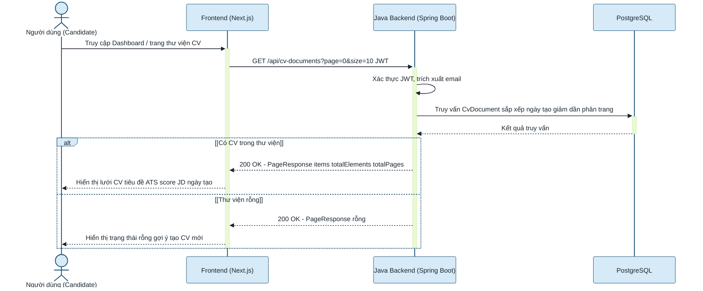
```mermaid
%%{init: {"theme": "base", "themeVariables": {"fontSize": "20px", "lineColor": "#2c3e50", "primaryColor": "#d6eaf8", "primaryBorderColor": "#1a5276", "primaryTextColor": "#1a252f"}, "sequence": {"actorMargin": 80, "width": 200, "height": 65, "messageMargin": 35}}}%%
sequenceDiagram
    actor ND as Người dùng (Candidate)
    participant FE as Frontend (Next.js)
    participant BE as Java Backend (Spring Boot)
    participant DB as PostgreSQL

    ND->>+FE: Truy cập Dashboard / trang thư viện CV
    FE->>+BE: GET /api/cv-documents?page=0&size=10 JWT
    BE->>BE: Xác thực JWT, trích xuất email
    BE->>+DB: Truy vấn CvDocument sắp xếp ngày tạo giảm dần phân trang
    DB-->>-BE: Kết quả truy vấn

    alt [Có CV trong thư viện]
        BE-->>FE: 200 OK - PageResponse items totalElements totalPages
        FE-->>ND: Hiển thị lưới CV tiêu đề ATS score JD ngày tạo
    else [Thư viện rỗng]
        BE-->>FE: 200 OK - PageResponse rỗng
        FE-->>ND: Hiển thị trạng thái rỗng gợi ý tạo CV mới
    end
    deactivate BE
    deactivate FE
```

## UC-13: Đặt CV làm CV chính

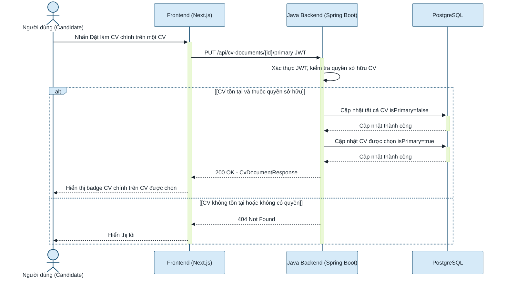
```mermaid
%%{init: {"theme": "base", "themeVariables": {"fontSize": "20px", "lineColor": "#2c3e50", "primaryColor": "#d6eaf8", "primaryBorderColor": "#1a5276", "primaryTextColor": "#1a252f"}, "sequence": {"actorMargin": 80, "width": 200, "height": 65, "messageMargin": 35}}}%%
sequenceDiagram
    actor ND as Người dùng (Candidate)
    participant FE as Frontend (Next.js)
    participant BE as Java Backend (Spring Boot)
    participant DB as PostgreSQL

    ND->>+FE: Nhấn Đặt làm CV chính trên một CV
    FE->>+BE: PUT /api/cv-documents/{id}/primary JWT
    BE->>BE: Xác thực JWT, kiểm tra quyền sở hữu CV

    alt [CV tồn tại và thuộc quyền sở hữu]
        BE->>+DB: Cập nhật tất cả CV isPrimary=false
        DB-->>-BE: Cập nhật thành công
        BE->>+DB: Cập nhật CV được chọn isPrimary=true
        DB-->>-BE: Cập nhật thành công
        BE-->>FE: 200 OK - CvDocumentResponse
        FE-->>ND: Hiển thị badge CV chính trên CV được chọn
    else [CV không tồn tại hoặc không có quyền]
        BE-->>FE: 404 Not Found
        FE-->>ND: Hiển thị lỗi
    end
    deactivate BE
    deactivate FE
```

## UC-14: Xoá CV

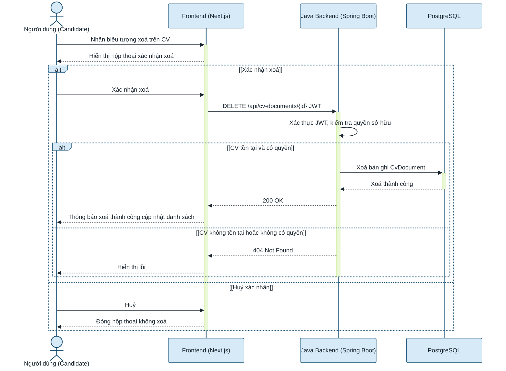
```mermaid
%%{init: {"theme": "base", "themeVariables": {"fontSize": "20px", "lineColor": "#2c3e50", "primaryColor": "#d6eaf8", "primaryBorderColor": "#1a5276", "primaryTextColor": "#1a252f"}, "sequence": {"actorMargin": 80, "width": 200, "height": 65, "messageMargin": 35}}}%%
sequenceDiagram
    actor ND as Người dùng (Candidate)
    participant FE as Frontend (Next.js)
    participant BE as Java Backend (Spring Boot)
    participant DB as PostgreSQL

    ND->>+FE: Nhấn biểu tượng xoá trên CV
    FE-->>ND: Hiển thị hộp thoại xác nhận xoá

    alt [Xác nhận xoá]
        ND->>FE: Xác nhận xoá
        FE->>+BE: DELETE /api/cv-documents/{id} JWT
        BE->>BE: Xác thực JWT, kiểm tra quyền sở hữu
        alt [CV tồn tại và có quyền]
            BE->>+DB: Xoá bản ghi CvDocument
            DB-->>-BE: Xoá thành công
            BE-->>FE: 200 OK
            FE-->>ND: Thông báo xoá thành công cập nhật danh sách
        else [CV không tồn tại hoặc không có quyền]
            BE-->>FE: 404 Not Found
            FE-->>ND: Hiển thị lỗi
        end
        deactivate BE
    else [Huỷ xác nhận]
        ND->>FE: Huỷ
        FE-->>ND: Đóng hộp thoại không xoá
    end
    deactivate FE
```

## UC-15: Tải xuống CV (DOCX)

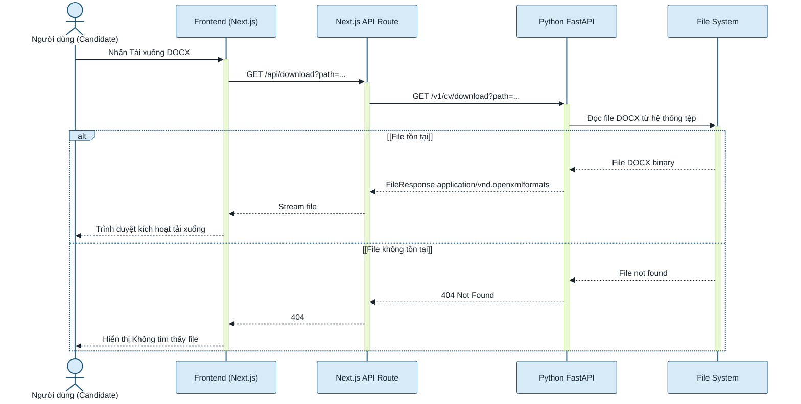
```mermaid
%%{init: {"theme": "base", "themeVariables": {"fontSize": "20px", "lineColor": "#2c3e50", "primaryColor": "#d6eaf8", "primaryBorderColor": "#1a5276", "primaryTextColor": "#1a252f"}, "sequence": {"actorMargin": 80, "width": 200, "height": 65, "messageMargin": 35}}}%%
sequenceDiagram
    actor ND as Người dùng (Candidate)
    participant FE as Frontend (Next.js)
    participant APIR as Next.js API Route
    participant PY as Python FastAPI
    participant FS as File System

    ND->>+FE: Nhấn Tải xuống DOCX
    FE->>+APIR: GET /api/download?path=...
    APIR->>+PY: GET /v1/cv/download?path=...
    PY->>+FS: Đọc file DOCX từ hệ thống tệp

    alt [File tồn tại]
        FS-->>PY: File DOCX binary
        PY-->>APIR: FileResponse application/vnd.openxmlformats
        APIR-->>FE: Stream file
        FE-->>ND: Trình duyệt kích hoạt tải xuống
    else [File không tồn tại]
        FS-->>PY: File not found
        PY-->>APIR: 404 Not Found
        APIR-->>FE: 404
        FE-->>ND: Hiển thị Không tìm thấy file
    end
    deactivate FS
    deactivate PY
    deactivate APIR
    deactivate FE
```

## UC-16: Xem danh sách Template CV

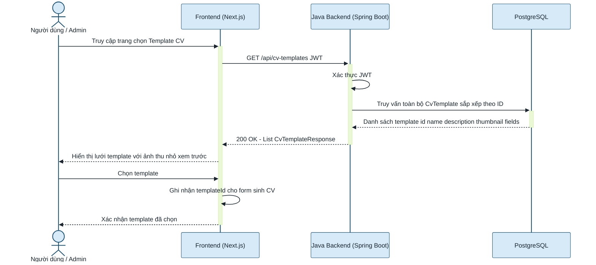
```mermaid
%%{init: {"theme": "base", "themeVariables": {"fontSize": "20px", "lineColor": "#2c3e50", "primaryColor": "#d6eaf8", "primaryBorderColor": "#1a5276", "primaryTextColor": "#1a252f"}, "sequence": {"actorMargin": 80, "width": 200, "height": 65, "messageMargin": 35}}}%%
sequenceDiagram
    actor ND as Người dùng / Admin
    participant FE as Frontend (Next.js)
    participant BE as Java Backend (Spring Boot)
    participant DB as PostgreSQL

    ND->>+FE: Truy cập trang chọn Template CV
    FE->>+BE: GET /api/cv-templates JWT
    BE->>BE: Xác thực JWT
    BE->>+DB: Truy vấn toàn bộ CvTemplate sắp xếp theo ID
    DB-->>-BE: Danh sách template id name description thumbnail fields
    BE-->>-FE: 200 OK - List CvTemplateResponse
    FE-->>ND: Hiển thị lưới template với ảnh thu nhỏ xem trước
    ND->>FE: Chọn template
    FE->>FE: Ghi nhận templateId cho form sinh CV
    FE-->>-ND: Xác nhận template đã chọn
```

## UC-17: Tìm kiếm mô tả công việc

```mermaid
%%{init: {"theme": "base", "themeVariables": {"fontSize": "20px", "lineColor": "#2c3e50", "primaryColor": "#d6eaf8", "primaryBorderColor": "#1a5276", "primaryTextColor": "#1a252f"}, "sequence": {"actorMargin": 80, "width": 200, "height": 65, "messageMargin": 35}}}%%
sequenceDiagram
    actor ND as Người dùng (Candidate)
    participant FE as Frontend (Next.js)
    participant PY as Python FastAPI
    participant Cache as Redis Cache
    participant VDB as ChromaDB Vector DB
    participant LLM as LLM OpenAI/Claude

    ND->>+FE: Nhập từ khoá tìm kiếm
    ND->>FE: Nhấn Tìm kiếm
    FE->>+PY: POST /v1/jd/search { query }
    PY->>+Cache: Kiểm tra cache TTL 30 giây

    alt [Kết quả trong cache]
        Cache-->>-PY: Kết quả đã cache
        PY-->>FE: 200 OK - Danh sách JD từ cache
        FE-->>ND: Hiển thị danh sách thẻ JD
    else [Không có trong cache]
        Cache-->>-PY: Cache miss
        PY->>+VDB: Tìm kiếm vector timeout 10 giây
        VDB-->>-PY: Kết quả raw kèm score
        PY->>PY: Tính điểm tổng hợp lọc ngưỡng >= 0.5 lấy top 10
        alt [Có kết quả]
            PY->>+LLM: Định dạng JD song song ThreadPoolExecutor 2 luồng
            LLM-->>-PY: JD đã định dạng
            PY->>+Cache: Lưu vào cache
            Cache-->>-PY: Đã lưu
            PY-->>FE: 200 OK - Danh sách JD card
            FE-->>ND: Hiển thị danh sách thẻ JD với điểm tương đồng
        else [Không có kết quả hoặc Timeout]
            PY-->>FE: 200 OK rỗng hoặc 504 Timeout
            FE-->>ND: Gợi ý thay đổi từ khoá hoặc lỗi timeout
        end
    end
    deactivate PY
    deactivate FE
```

## UC-18: Xem chi tiết mô tả công việc

```mermaid
%%{init: {"theme": "base", "themeVariables": {"fontSize": "20px", "lineColor": "#2c3e50", "primaryColor": "#d6eaf8", "primaryBorderColor": "#1a5276", "primaryTextColor": "#1a252f"}, "sequence": {"actorMargin": 80, "width": 200, "height": 65, "messageMargin": 35}}}%%
sequenceDiagram
    actor ND as Người dùng (Candidate)
    participant FE as Frontend (Next.js)
    participant PY as Python FastAPI
    participant Cache as Format Cache
    participant VDB as ChromaDB
    participant LLM as LLM OpenAI/Claude

    ND->>+FE: Nhấn vào thẻ JD muốn xem chi tiết
    FE->>+PY: POST /v1/jd/format { jd_id }
    PY->>+Cache: Kiểm tra format cache

    alt [Có trong cache]
        Cache-->>-PY: JD đã định dạng
        PY-->>FE: 200 OK - JDFormattedDetail từ cache
        FE-->>ND: Hiển thị JD chi tiết dạng cấu trúc
    else [Chưa có trong cache]
        Cache-->>-PY: Cache miss
        PY->>+VDB: Lấy JD thô theo jd_id
        VDB-->>-PY: JD thô
        PY->>+LLM: Định dạng JD thành bullet có cấu trúc
        alt [LLM phản hồi thành công]
            LLM-->>-PY: JDFormattedDetail description requirements benefits quick_info
            PY->>PY: Chuẩn hoá thuật ngữ loại bỏ trùng lặp
        else [LLM không phản hồi]
            PY->>PY: Text-based parsing thay thế
        end
        PY->>+Cache: Lưu kết quả
        Cache-->>-PY: Đã lưu
        PY-->>FE: 200 OK - JDFormattedDetail
        FE-->>ND: Hiển thị JD chi tiết dạng cấu trúc
    end
    ND->>FE: Nhấn Dùng cho CV
    FE->>FE: Chuyển nội dung JD sang form sinh CV
    FE-->>-ND: Mở form sinh CV với JD đã điền sẵn
    deactivate PY
```

## UC-19: Xem Dashboard quản trị

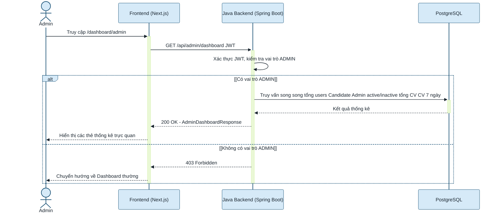
```mermaid
%%{init: {"theme": "base", "themeVariables": {"fontSize": "20px", "lineColor": "#2c3e50", "primaryColor": "#d6eaf8", "primaryBorderColor": "#1a5276", "primaryTextColor": "#1a252f"}, "sequence": {"actorMargin": 80, "width": 200, "height": 65, "messageMargin": 35}}}%%
sequenceDiagram
    actor Admin
    participant FE as Frontend (Next.js)
    participant BE as Java Backend (Spring Boot)
    participant DB as PostgreSQL

    Admin->>+FE: Truy cập /dashboard/admin
    FE->>+BE: GET /api/admin/dashboard JWT
    BE->>BE: Xác thực JWT, kiểm tra vai trò ADMIN

    alt [Có vai trò ADMIN]
        BE->>+DB: Truy vấn song song tổng users Candidate Admin active/inactive tổng CV CV 7 ngày
        DB-->>-BE: Kết quả thống kê
        BE-->>FE: 200 OK - AdminDashboardResponse
        FE-->>Admin: Hiển thị các thẻ thống kê trực quan
    else [Không có vai trò ADMIN]
        BE-->>FE: 403 Forbidden
        FE-->>Admin: Chuyển hướng về Dashboard thường
    end
    deactivate BE
    deactivate FE
```

## UC-20a: Xem danh sách người dùng (Admin)

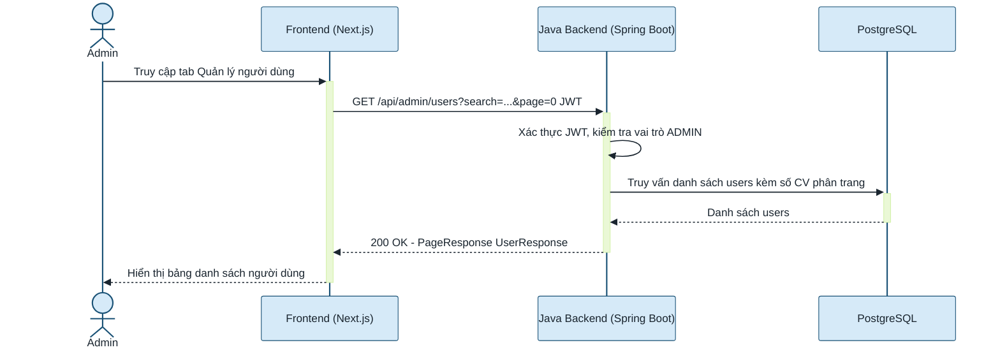
```mermaid
%%{init: {"theme": "base", "themeVariables": {"fontSize": "20px", "lineColor": "#2c3e50", "primaryColor": "#d6eaf8", "primaryBorderColor": "#1a5276", "primaryTextColor": "#1a252f"}, "sequence": {"actorMargin": 80, "width": 200, "height": 65, "messageMargin": 35}}}%%
sequenceDiagram
    actor Admin
    participant FE as Frontend (Next.js)
    participant BE as Java Backend (Spring Boot)
    participant DB as PostgreSQL

    Admin->>+FE: Truy cập tab Quản lý người dùng
    FE->>+BE: GET /api/admin/users?search=...&page=0 JWT
    BE->>BE: Xác thực JWT, kiểm tra vai trò ADMIN
    BE->>+DB: Truy vấn danh sách users kèm số CV phân trang
    DB-->>-BE: Danh sách users
    BE-->>-FE: 200 OK - PageResponse UserResponse
    FE-->>-Admin: Hiển thị bảng danh sách người dùng
```

## UC-20b: Tạo người dùng mới (Admin)

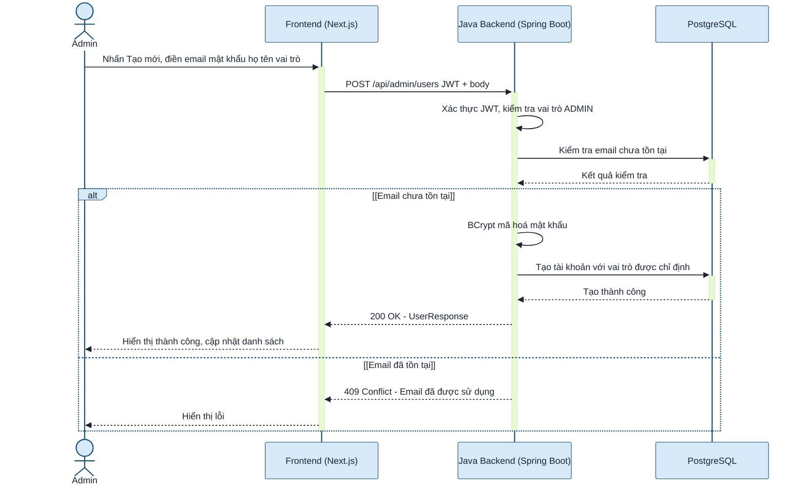
```mermaid
%%{init: {"theme": "base", "themeVariables": {"fontSize": "20px", "lineColor": "#2c3e50", "primaryColor": "#d6eaf8", "primaryBorderColor": "#1a5276", "primaryTextColor": "#1a252f"}, "sequence": {"actorMargin": 80, "width": 200, "height": 65, "messageMargin": 35}}}%%
sequenceDiagram
    actor Admin
    participant FE as Frontend (Next.js)
    participant BE as Java Backend (Spring Boot)
    participant DB as PostgreSQL

    Admin->>+FE: Nhấn Tạo mới, điền email mật khẩu họ tên vai trò
    FE->>+BE: POST /api/admin/users JWT + body
    BE->>BE: Xác thực JWT, kiểm tra vai trò ADMIN
    BE->>+DB: Kiểm tra email chưa tồn tại
    DB-->>-BE: Kết quả kiểm tra

    alt [Email chưa tồn tại]
        BE->>BE: BCrypt mã hoá mật khẩu
        BE->>+DB: Tạo tài khoản với vai trò được chỉ định
        DB-->>-BE: Tạo thành công
        BE-->>FE: 200 OK - UserResponse
        FE-->>Admin: Hiển thị thành công, cập nhật danh sách
    else [Email đã tồn tại]
        BE-->>FE: 409 Conflict - Email đã được sử dụng
        FE-->>Admin: Hiển thị lỗi
    end
    deactivate BE
    deactivate FE
```

## UC-20c: Cập nhật thông tin người dùng (Admin)

```mermaid
%%{init: {"theme": "base", "themeVariables": {"fontSize": "20px", "lineColor": "#2c3e50", "primaryColor": "#d6eaf8", "primaryBorderColor": "#1a5276", "primaryTextColor": "#1a252f"}, "sequence": {"actorMargin": 80, "width": 200, "height": 65, "messageMargin": 35}}}%%
sequenceDiagram
    actor Admin
    participant FE as Frontend (Next.js)
    participant BE as Java Backend (Spring Boot)
    participant DB as PostgreSQL

    Admin->>+FE: Chọn người dùng, chỉnh sửa thông tin và nhấn Lưu
    FE->>+BE: PUT /api/admin/users/{id} JWT + body
    BE->>BE: Xác thực JWT, kiểm tra vai trò ADMIN
    BE->>BE: Kiểm tra ràng buộc bảo vệ (không tự vô hiệu hoá bản thân)
    BE->>+DB: Kiểm tra người dùng tồn tại
    DB-->>-BE: User record

    alt [Hợp lệ]
        BE->>+DB: Cập nhật thông tin người dùng
        DB-->>-BE: Cập nhật thành công
        BE-->>FE: 200 OK - UserResponse
        FE-->>Admin: Hiển thị Cập nhật thành công
    else [Vi phạm ràng buộc bảo vệ]
        BE-->>FE: 400 - Vi phạm ràng buộc
        FE-->>Admin: Hiển thị lỗi ràng buộc
    else [Người dùng không tồn tại]
        BE-->>FE: 404 Not Found
        FE-->>Admin: Hiển thị lỗi
    end
    deactivate BE
    deactivate FE
```

## UC-20d: Xoá người dùng (Admin)

```mermaid
%%{init: {"theme": "base", "themeVariables": {"fontSize": "20px", "lineColor": "#2c3e50", "primaryColor": "#d6eaf8", "primaryBorderColor": "#1a5276", "primaryTextColor": "#1a252f"}, "sequence": {"actorMargin": 80, "width": 200, "height": 65, "messageMargin": 35}}}%%
sequenceDiagram
    actor Admin
    participant FE as Frontend (Next.js)
    participant BE as Java Backend (Spring Boot)
    participant DB as PostgreSQL

    Admin->>+FE: Nhấn xoá người dùng
    FE-->>Admin: Hiển thị hộp thoại xác nhận xoá

    alt [Xác nhận xoá]
        Admin->>FE: Xác nhận
        FE->>+BE: DELETE /api/admin/users/{id} JWT
        BE->>BE: Xác thực JWT, kiểm tra vai trò ADMIN
        BE->>BE: Kiểm tra Admin không tự xoá bản thân
        alt [Hợp lệ]
            BE->>+DB: Xoá tài khoản và dữ liệu liên quan cascade
            DB-->>-BE: Xoá thành công
            BE-->>FE: 200 OK
            FE-->>Admin: Thông báo xoá thành công, cập nhật danh sách
        else [Admin tự xoá bản thân]
            BE-->>FE: 400 - Không thể tự xoá tài khoản
            FE-->>Admin: Hiển thị lỗi
        end
        deactivate BE
    else [Huỷ xác nhận]
        Admin->>FE: Huỷ
        FE-->>Admin: Đóng hộp thoại, không xoá
    end
    deactivate FE
```

## UC-21a: Xem danh sách Template CV (Admin)

```mermaid
%%{init: {"theme": "base", "themeVariables": {"fontSize": "20px", "lineColor": "#2c3e50", "primaryColor": "#d6eaf8", "primaryBorderColor": "#1a5276", "primaryTextColor": "#1a252f"}, "sequence": {"actorMargin": 80, "width": 200, "height": 65, "messageMargin": 35}}}%%
sequenceDiagram
    actor Admin
    participant FE as Frontend (Next.js)
    participant BE as Java Backend (Spring Boot)
    participant DB as PostgreSQL

    Admin->>+FE: Truy cập tab Quản lý Template
    FE->>+BE: GET /api/cv-templates?page=0 JWT
    BE->>BE: Xác thực JWT, kiểm tra vai trò ADMIN
    BE->>+DB: Truy vấn danh sách template phân trang
    DB-->>-BE: Danh sách template
    BE-->>-FE: 200 OK - PageResponse CvTemplateResponse
    FE-->>-Admin: Hiển thị bảng danh sách template
```

## UC-21b: Tạo Template CV mới (Admin)

```mermaid
%%{init: {"theme": "base", "themeVariables": {"fontSize": "20px", "lineColor": "#2c3e50", "primaryColor": "#d6eaf8", "primaryBorderColor": "#1a5276", "primaryTextColor": "#1a252f"}, "sequence": {"actorMargin": 80, "width": 200, "height": 65, "messageMargin": 35}}}%%
sequenceDiagram
    actor Admin
    participant FE as Frontend (Next.js)
    participant BE as Java Backend (Spring Boot)
    participant DB as PostgreSQL

    Admin->>+FE: Nhấn Tạo mới, điền name description fields thumbnail
    FE->>+BE: POST /api/cv-templates JWT + body
    BE->>BE: Xác thực JWT, kiểm tra vai trò ADMIN

    alt [Dữ liệu hợp lệ]
        BE->>+DB: Lưu template mới vào CSDL
        DB-->>-BE: Lưu thành công
        BE-->>FE: 200 OK - CvTemplateResponse
        FE-->>Admin: Hiển thị thành công, cập nhật danh sách
    else [Dữ liệu không hợp lệ]
        BE-->>FE: 400 Bad Request
        FE-->>Admin: Hiển thị lỗi validate
    end
    deactivate BE
    deactivate FE
```

## UC-21c: Cập nhật Template CV (Admin)

```mermaid
%%{init: {"theme": "base", "themeVariables": {"fontSize": "20px", "lineColor": "#2c3e50", "primaryColor": "#d6eaf8", "primaryBorderColor": "#1a5276", "primaryTextColor": "#1a252f"}, "sequence": {"actorMargin": 80, "width": 200, "height": 65, "messageMargin": 35}}}%%
sequenceDiagram
    actor Admin
    participant FE as Frontend (Next.js)
    participant BE as Java Backend (Spring Boot)
    participant DB as PostgreSQL

    Admin->>+FE: Chọn template, chỉnh sửa và nhấn Lưu
    FE->>+BE: PUT /api/cv-templates/{id} JWT + body
    BE->>BE: Xác thực JWT, kiểm tra vai trò ADMIN
    BE->>+DB: Kiểm tra template tồn tại
    DB-->>-BE: Template record

    alt [Template tồn tại]
        BE->>+DB: Cập nhật thông tin template
        DB-->>-BE: Cập nhật thành công
        BE-->>FE: 200 OK - CvTemplateResponse
        FE-->>Admin: Hiển thị Cập nhật thành công
    else [Template không tồn tại]
        BE-->>FE: 404 Not Found
        FE-->>Admin: Hiển thị lỗi
    end
    deactivate BE
    deactivate FE
```

## UC-21d: Xoá Template CV (Admin)

```mermaid
%%{init: {"theme": "base", "themeVariables": {"fontSize": "20px", "lineColor": "#2c3e50", "primaryColor": "#d6eaf8", "primaryBorderColor": "#1a5276", "primaryTextColor": "#1a252f"}, "sequence": {"actorMargin": 80, "width": 200, "height": 65, "messageMargin": 35}}}%%
sequenceDiagram
    actor Admin
    participant FE as Frontend (Next.js)
    participant BE as Java Backend (Spring Boot)
    participant DB as PostgreSQL

    Admin->>+FE: Nhấn xoá template
    FE-->>Admin: Hiển thị hộp thoại xác nhận xoá

    alt [Xác nhận xoá]
        Admin->>FE: Xác nhận
        FE->>+BE: DELETE /api/cv-templates/{id} JWT
        BE->>BE: Xác thực JWT, kiểm tra vai trò ADMIN
        alt [Template tồn tại]
            BE->>+DB: Xoá template khỏi CSDL
            DB-->>-BE: Xoá thành công
            BE-->>FE: 200 OK
            FE-->>Admin: Thông báo xoá thành công, cập nhật danh sách
        else [Template không tồn tại]
            BE-->>FE: 404 Not Found
            FE-->>Admin: Hiển thị lỗi
        end
        deactivate BE
    else [Huỷ xác nhận]
        Admin->>FE: Huỷ
        FE-->>Admin: Đóng hộp thoại, không xoá
    end
    deactivate FE
```

## UC-22: Sinh CV bằng AI

```mermaid
%%{init: {"theme": "base", "themeVariables": {"fontSize": "20px", "lineColor": "#2c3e50", "primaryColor": "#d6eaf8", "primaryBorderColor": "#1a5276", "primaryTextColor": "#1a252f"}, "sequence": {"actorMargin": 80, "width": 200, "height": 65, "messageMargin": 35}}}%%
sequenceDiagram
    actor ND as Người dùng (Candidate)
    participant FE as Frontend (Next.js)
    participant PY as Python FastAPI
    participant LG as LangGraph Pipeline
    participant LLM as LLM OpenAI/Claude
    participant VDB as ChromaDB RAG
    participant FS as File System

    ND->>+FE: Điền JD hồ sơ chọn template và ngôn ngữ
    ND->>FE: Nhấn Sinh CV
    FE->>+PY: POST /v1/cv/generate hoặc /generate/async
    PY->>+LG: Khởi động pipeline LangGraph
    LG->>+LLM: jd_analyzer_node - Phân tích JD
    LLM-->>-LG: JobRequirement
    LG->>LG: profile_normalizer_node - Chuẩn hoá hồ sơ
    LG->>+VDB: summary_agent - Truy vấn RAG ví dụ tóm tắt
    VDB-->>-LG: Ví dụ tương đồng
    LG->>+LLM: summary_agent - Sinh tóm tắt chuyên nghiệp
    LLM-->>-LG: Professional summary
    LG->>+LLM: experience và skills agents song song
    LLM-->>-LG: Bullets STAR và Skills đã phân loại
    LG->>+LLM: qc_agent - Kiểm định chất lượng
    LLM-->>-LG: QualityScore và feedback

    alt [Điểm >= 7.0 hoặc hết lượt sửa - có template]
        LG->>+FS: template_renderer - Render và lưu DOCX
        FS-->>-LG: output_path
        LG-->>-PY: output_path quality_score cv_draft
        PY-->>-FE: 200 OK - CVGenerateResponse
        FE-->>-ND: Hiển thị xem trước CV và điểm chất lượng
    else [Điểm < 7.0 và còn lượt sửa]
        LG->>LG: Vòng lặp sửa đổi quay lại summary_agent
    else [Pipeline thất bại]
        LG-->>-PY: Lỗi pipeline
        PY-->>-FE: 500 - Lỗi sinh CV
        FE-->>-ND: Gợi ý thử lại
    end
```

## UC-23: Tác nhân Phân tích JD

```mermaid
%%{init: {"theme": "base", "themeVariables": {"fontSize": "20px", "lineColor": "#2c3e50", "primaryColor": "#d6eaf8", "primaryBorderColor": "#1a5276", "primaryTextColor": "#1a252f"}, "sequence": {"actorMargin": 80, "width": 200, "height": 65, "messageMargin": 35}}}%%
sequenceDiagram
    participant LG as LangGraph Pipeline
    participant Node as jd_analyzer_node
    participant LLM as LLM tier cheap

    LG->>+Node: Truyền state.job_description
    Node->>+LLM: Gửi prompt trích xuất có cấu trúc
    LLM-->>-Node: JobRequirement job_title required_skills preferred_skills soft_skills years_experience keywords industry seniority_level

    alt [Trích xuất thành công]
        Node->>LG: Lưu JobRequirement vào state
        Node->>Node: Ghi log jd_analyzer Analyzed job_title
        LG->>LG: Chuyển sang profile_normalizer_node
    else [LLM không trích xuất được]
        Node->>LG: Lưu JobRequirement rỗng
        Node->>Node: Ghi log cảnh báo
        LG->>LG: Tiếp tục với dữ liệu rỗng
    end
    deactivate Node
```

## UC-24: Tác nhân Sinh tóm tắt

```mermaid
%%{init: {"theme": "base", "themeVariables": {"fontSize": "20px", "lineColor": "#2c3e50", "primaryColor": "#d6eaf8", "primaryBorderColor": "#1a5276", "primaryTextColor": "#1a252f"}, "sequence": {"actorMargin": 80, "width": 200, "height": 65, "messageMargin": 35}}}%%
sequenceDiagram
    participant LG as LangGraph Pipeline
    participant Node as summary_agent_node
    participant VDB as ChromaDB RAG
    participant LLM as LLM tier strong

    LG->>+Node: Truyền user_profile và job_requirement
    Node->>+VDB: Truy vấn ví dụ tóm tắt tương đồng job_title industry seniority
    alt [Có ví dụ RAG phù hợp]
        VDB-->>-Node: Ví dụ tóm tắt tương đồng
    else [Không có ví dụ phù hợp]
        VDB-->>-Node: Không có kết quả
    end
    Node->>Node: Xây dựng prompt user_profile và JD và RAG và QC feedback
    Node->>+LLM: Sinh tóm tắt chuyên nghiệp 3-4 câu 50-80 từ ngôn ngữ vi/en
    LLM-->>-Node: Đoạn tóm tắt
    Node->>-LG: Lưu summary vào state.cv_draft.summary
```

## UC-25: Tác nhân Viết bullet kinh nghiệm

```mermaid
%%{init: {"theme": "base", "themeVariables": {"fontSize": "20px", "lineColor": "#2c3e50", "primaryColor": "#d6eaf8", "primaryBorderColor": "#1a5276", "primaryTextColor": "#1a252f"}, "sequence": {"actorMargin": 80, "width": 200, "height": 65, "messageMargin": 35}}}%%
sequenceDiagram
    participant LG as LangGraph Pipeline
    participant Node as experience_agent_node
    participant Pool as ThreadPoolExecutor 4 luồng
    participant VDB as ChromaDB RAG
    participant LLM as LLM tier strong

    LG->>+Node: Truyền work_experiences[] và job_requirement
    Node->>+Pool: Khởi động song song max 4 luồng

    loop Mỗi vị trí làm việc song song
        Pool->>+VDB: Truy vấn ví dụ bullet vị trí ngành cấp độ
        VDB-->>-Pool: Ví dụ bullet tương đồng
        Pool->>+LLM: Sinh 3-5 bullet STAR động từ mạnh tích hợp từ khoá JD
        LLM-->>-Pool: Danh sách bullet STAR
    end

    Pool-->>-Node: Kết quả tổng hợp tất cả luồng
    Node->>-LG: Lưu vào state.cv_draft.experiences
```

## UC-26: Tác nhân Phân loại kỹ năng

```mermaid
%%{init: {"theme": "base", "themeVariables": {"fontSize": "20px", "lineColor": "#2c3e50", "primaryColor": "#d6eaf8", "primaryBorderColor": "#1a5276", "primaryTextColor": "#1a252f"}, "sequence": {"actorMargin": 80, "width": 200, "height": 65, "messageMargin": 35}}}%%
sequenceDiagram
    participant LG as LangGraph Pipeline
    participant Node as skills_agent_node
    participant LLM as LLM tier cheap

    LG->>+Node: Truyền skills_raw[] và job_requirement.required_skills[]
    Node->>+LLM: Gửi toàn bộ kỹ năng thô và yêu cầu JD
    LLM-->>-Node: Kỹ năng đã phân loại Ngôn ngữ lập trình Frameworks Databases DevOps Tools Kỹ năng mềm
    Node->>Node: Đặt kỹ năng theo JD lên đầu mỗi nhóm
    Node->>Node: Gộp kỹ năng tương đương JS bằng JavaScript
    Node->>-LG: Lưu vào state.cv_draft.skills_categorized
```

## UC-27: Tác nhân Kiểm định chất lượng CV

```mermaid
%%{init: {"theme": "base", "themeVariables": {"fontSize": "20px", "lineColor": "#2c3e50", "primaryColor": "#d6eaf8", "primaryBorderColor": "#1a5276", "primaryTextColor": "#1a252f"}, "sequence": {"actorMargin": 80, "width": 200, "height": 65, "messageMargin": 35}}}%%
sequenceDiagram
    participant LG as LangGraph Pipeline
    participant Node as qc_agent_node
    participant LLM as LLM tier cheap

    LG->>+Node: Truyền cv_draft và job_requirement
    Node->>+LLM: Chấm điểm 3 tiêu chí thang 0-10
    LLM-->>-Node: ATS_SCORE từ khoá 40% cấu trúc 30% thuật ngữ 30% và JD_MATCH kinh nghiệm 40% kỹ năng 30% tóm tắt 20% cấp độ 10% và LINGUISTIC STAR 40% động từ 20% ngữ pháp 20% không sáo 20%
    Node->>Node: Tính OVERALL bằng trung bình 3 tiêu chí
    Node->>Node: Tăng revision_count lên 1
    Node->>LG: Lưu QualityScore vào state

    alt [OVERALL >= 7.0 hoặc revision > max_revisions và có template]
        LG->>LG: Chuyển sang template_renderer_node
    else [OVERALL >= 7.0 hoặc revision > max_revisions và không có template]
        LG->>LG: Kết thúc pipeline
    else [OVERALL < 7.0 và còn lượt sửa]
        LG->>LG: Quay lại summary_agent_node vòng lặp sửa đổi
    end
    deactivate Node
```

## UC-28: Tác nhân Render Template DOCX

```mermaid
%%{init: {"theme": "base", "themeVariables": {"fontSize": "20px", "lineColor": "#2c3e50", "primaryColor": "#d6eaf8", "primaryBorderColor": "#1a5276", "primaryTextColor": "#1a252f"}, "sequence": {"actorMargin": 80, "width": 200, "height": 65, "messageMargin": 35}}}%%
sequenceDiagram
    participant LG as LangGraph Pipeline
    participant Node as template_renderer_node
    participant FS as File System
    participant LLM as LLM cho exemplar

    LG->>+Node: Truyền cv_draft và user_profile và template_path
    Node->>+FS: Đọc file DOCX template
    FS-->>-Node: File DOCX

    alt [File template tồn tại]
        alt [(a) Template placeholder có FIELD_NAME]
            Node->>Node: Ánh xạ placeholder với trường CV
            Node->>Node: Điền thông tin cá nhân xây dựng sections
            Node->>Node: Chèn ảnh nếu supportsPhotoUpload
        else [(b) Template định sẵn ID 1-5]
            Node->>Node: Dùng ánh xạ vị trí đoạn văn mã hoá cứng
        else [(c) Template mẫu exemplar]
            Node->>+LLM: Phát hiện sections trong template
            LLM-->>-Node: Danh sách sections đã phát hiện
            Node->>Node: Điền nội dung và bổ sung section còn thiếu
        end
        Node->>+FS: Lưu file cv_timestamp.docx vào outputs/
        FS-->>-Node: Lưu thành công
        Node->>-LG: Lưu output_path vào state
    else [Không tìm thấy file template]
        Node->>Node: Ghi lỗi vào nhật ký
        Node->>-LG: Kết thúc pipeline không có file xuất
    end
```

## UC-29: Xây dựng chỉ mục RAG

```mermaid
%%{init: {"theme": "base", "themeVariables": {"fontSize": "20px", "lineColor": "#2c3e50", "primaryColor": "#d6eaf8", "primaryBorderColor": "#1a5276", "primaryTextColor": "#1a252f"}, "sequence": {"actorMargin": 80, "width": 200, "height": 65, "messageMargin": 35}}}%%
sequenceDiagram
    actor Admin
    participant PY as Python FastAPI
    participant BG as Background Task
    participant VDB as ChromaDB
    participant HF as HuggingFace Dataset
    participant SD as Seed Data

    Admin->>+PY: POST /v1/cv/rag/build { source reset max_records include_seed }
    PY->>PY: Kiểm tra không có tiến trình build nào đang chạy

    alt [Không có build đang chạy]
        PY-->>Admin: 202 Accepted trả về ngay
        PY->>+BG: Khởi động background task
        alt [(a) source = seed]
            BG->>+SD: Nạp ví dụ CV được tuyển chọn thủ công
            SD-->>-BG: Dữ liệu seed
            BG->>+VDB: Lập chỉ mục seed data
            VDB-->>-BG: Lập chỉ mục thành công
        else [(b) source = hf]
            BG->>+HF: Tải dataset từ HuggingFace
            HF-->>-BG: Dataset CV
            BG->>+VDB: Lập chỉ mục hàng loạt HuggingFace embeddings
            VDB-->>-BG: Lập chỉ mục thành công
        end
        BG->>BG: Ghi kết quả build số bản ghi thời gian
        BG-->>-PY: Build hoàn thành
        Admin->>+PY: GET /v1/cv/rag/build/status
        PY-->>-Admin: Trạng thái hoàn thành
        Admin->>+PY: GET /v1/cv/rag/stats
        PY->>+VDB: Truy vấn thống kê
        VDB-->>-PY: collection_count total_embeddings
        PY-->>-Admin: RAG stats
    else [Build đang chạy]
        PY-->>-Admin: 409 Conflict - RAG build đang chạy
    end
```

---
